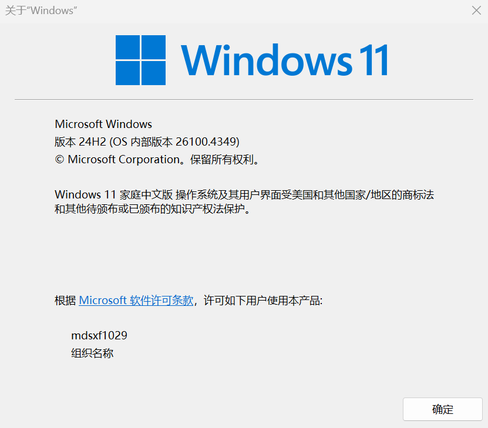
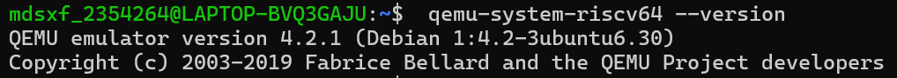
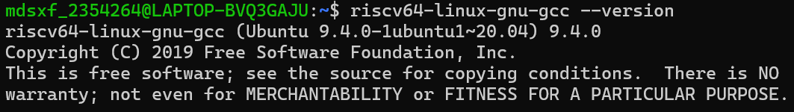

# xv6-Based Operating System Lab Report

> 姓名：谢雨霏
> 学号：2354264
> 源代码：
> 各实验详细代码可切换至不同 Branch 查看

## Tools

### Installing on Windows

1. 下载 Windows Subsystem for Linux 和 Ubuntu 20.04 from the Microsoft Store。
   在 Windows 中，可以访问"\wsl\$"目录下的所有 WSL 文件。例如，Ubuntu 20.04 的主目录应该在"\wsl\$Ubuntu-20.04\home"

   ```cmd
   C:\Users\mdsxf1029>wsl --install
   适用于 Linux 的 Windows 子系统已安装。
   ```
2. 检查 WSL2 的要求：win+R 打开运行，输入 winver 检查 Windows 版本，版本要求大于 1903
   
3. 安装 Ubuntu

   ```cmd
   C:\Windows\System32>wsl --install -d Ubuntu-20.04
   Ubuntu 20.04 LTS 已安装。
   正在启动 Ubuntu 20.04 LTS...
   Enter new UNIX username: mdsxf_2354264
   New password:
   Retype new password:
   passwd: password updated successfully
   Installation successful!
   ```
4. 下载本课程所需的所有软件

   ```cmd
   $ sudo apt-get update && sudo apt-get upgrade
   $ sudo apt-get install git build-essential gdb-multiarch qemu-system-misc gcc-riscv64-linux-gnu binutils-riscv64-linux-gnu
   ```

### Testing Installation

```cmd
$ qemu-system-riscv64 --version
```



```cmd
$ riscv64-linux-gnu-gcc --version
```



---

## Guidance

- 本实验通过多个难度递增的任务帮助我们逐步掌握操作系统核心机制。每个任务的代码量不大，但对底层细节要求极高，强调对内核机制的理解和调试能力的培养。
- 本次实验让我体会到内核级调试和普通程序开发完全不同。我逐渐熟练使用如 GDB、QEMU monitor、print 调试等工具，并意识到每一步调试都需要高度谨慎。通过按步骤实现并配合 Git 快照控制，能有效避免返工。

---

## Lab Utilities

### 实验概述

本实验我们将熟悉 xv6 及部分重要的系统调用。

### Boot xv6

1. 获取实验室的 xv6 源代码并检查 util 分支：

   ```cmd
   $ git clone git://g.csail.mit.edu/xv6-labs-2021
   Cloning into 'xv6-labs-2021'...
   ...
   $ cd xv6-labs-2021
   $ git checkout util
   ```

   
2. xv6-labs-2021 仓库与书中的 xv6-riscv 略有不同；它主要增加了一些文件。可使用 `$ git log` 命令查看 git 日志：
   
3. Git 允许我们跟踪对代码所做的更改。例如，如果你完成了某个练习，并想要检查进度，可以运行以下命令提交更改：

   ```cmd
   $ git commit -am 'my solution for util lab exercise 1'
   ```
4. 可以使用命令来跟踪你的更改 `git diff`。运行命令 `git diff` 将显示自上次提交以来的代码更改，并 `git diff origin/util` 显示相对于初始 `xv6-labs-2021` 代码的更改。这里，`origin/xv6-labs-2021` 是你为该课程下载的初始代码所在的 `git` 分支的名称。
5. 构建并运行 xv6：

   ```cmd
   $ make qemu
   ```

   
   
6. 在 prompt 下输入 `ls`：

   

   这些是 mkfs 在初始文件系统中包含的文件；大多数是可以运行的程序。输入 `ls` 就是运行了其中一个。
7. xv6 没有 ps 命令，但是，如果你输入 `Ctrl-p`，内核会打印每个进程的信息。如果你现在尝试一下，你会看到两行：一行是 init，一行是 sh。
   
8. 要退出 `qemu`，请输入：`Ctrl-a x`。
   

---

### sleep

#### 实验目的

1. 为 xv6 实现 UNIX 程序 sleep。
2. 实现的 sleep 应当按用户指定的 ticks 数暂停，其中 tick 是 xv6 内核定义的时间概念，即定时器芯片两次中断之间的时间。解决方案应该放在文件 `user/sleep.c` 中。

#### 实验步骤

1. 阅读 xv6 教材第 1 章，了解 xv6 的用户程序结构和系统调用机制；
2. 查看 `user/echo.c`、`user/grep.c` 等示例程序，学习如何读取命令行参数并进行基本处理；
3. 阅读以下文件，理解 `sleep` 系统调用的实现路径：
   - `user/user.h`：声明了 `sleep(int)` 函数，用户程序可以直接调用；
   - `user/usys.S`：包含从用户态跳转到内核态的汇编代码；
   - `kernel/sysproc.c`：查找 `sys_sleep`，查看内核中 `sleep` 系统调用的实现逻辑。
4. 创建新文件 `user/sleep.c`，并实现如下功能：
   - 判断命令行参数是否存在；
   - 使用 `atoi()` 将参数从字符串转换为整数；
   - 调用系统调用 `sleep(ticks)`；
   - 程序结束前调用 `exit(0)` 正常退出。
5. 代码如下：

```c
#include "kernel/types.h"
#include "user/user.h"

int main(int argc, char *argv[]) {
  if (argc != 2) {
    fprintf(2, "Usage: sleep ticks\n");
    exit(1);
  }
  int ticks = atoi(argv[1]);
  sleep(ticks);
  exit(0);
}
```

6. 打开 `Makefile`，找到 `UPROGS` 项；
   
7. 添加一行：

   ```bash
   UPROGS = $U/_sleep\
   ```

   
8. 在终端执行以下命令编译 xv6 并启动：

   ```bash
   make qemu
   ```
9. 在 xv6 shell 中输入：

```bash
   $ sleep 10
```

10. 程序应暂停一段时间后返回，表示 `sleep` 成功运行。
11. 运行测试用例验证实验是否通过：

```bash
   make grade
```

12. 或者单独测试 `sleep` 题目：

```bash
   ./grade-lab-util sleep
```

   

#### 实验中遇到的问题和解决方法

1. vim 编辑器的使用
   - 进入插入模式：按下 `i` 键，开始编辑文本。
   - 退出插入模式回到普通模式：按下 `Esc` 键。
   - 保存并退出：在普通模式下输入 `:wq`，然后按回车（Enter）。
   - 不保存强制退出：在普通模式下输入 `:q!`，然后按回车。

#### 实验心得

- 通过本次 sleep 实验，我对 xv6 操作系统的用户程序设计和系统调用机制有了更深入的理解。实现 sleep 程序让我熟悉了如何从用户态调用内核态的系统调用，以及内核如何通过中断计时器来实现进程的休眠功能。
- 在阅读教材和内核源码时，我逐渐掌握了参数传递、系统调用的汇编跳转流程以及内核中进程睡眠与唤醒的实现方法。编写 user/sleep.c 程序时，遇到了判断命令行参数和调用系统调用的细节问题，通过查阅示例程序和调试，我解决了这些问题并实现了功能。
- 此外，修改 Makefile 添加自定义用户程序，使我体验了完整的编译流程和 xv6 的启动过程，加深了对操作系统构建的理解。最后通过测试用例验证，程序能够按预期暂停指定的 ticks，达到了实验目标。
- 这次实验不仅锻炼了我的 C 语言编程能力，还提高了我阅读和理解操作系统源码的水平，为后续深入学习 xv6 及操作系统相关知识奠定了坚实基础。

---

### pingpong

#### 实验目的

1. 掌握 xv6 中进程间通信的基本方法。
2. 练习使用 `pipe()` 实现父子进程间的双向数据传输。
3. 熟悉 `fork()` 创建子进程、`write()`/`read()` 进行数据写入与读取的过程。
4. 理解 `getpid()` 获取当前进程 PID 的机制。
5. 熟悉用户程序的编译流程以及如何将自定义程序添加至 xv6 并执行。

#### 实验步骤

1. 阅读教材第 1 章，理解进程、系统调用和管道（pipe）的基本概念。
2. 编写程序文件
   在 `user/` 目录下创建 `pingpong.c` 文件，实现以下逻辑：
   - 创建两个 pipe，一个用于父进程写子进程读（父->子），一个用于子进程写父进程读（子->父）。
   - 使用 `fork()` 创建子进程。
   - 父进程写入一个字节后，从子进程读取响应。
   - 子进程收到数据后打印 `"pid: received ping"`，再将数据写回父进程，随后退出。
   - 父进程收到子进程数据后打印 `"pid: received pong"`，然后退出。
3. 代码如下：

```c
#include "kernel/types.h"
#include "user/user.h"

int main() 
{
    int p2c[2], c2p[2];
    pipe(p2c);
    pipe(c2p);

    if (fork() == 0)
    {
        // child
        char buf[1];
        read(p2c[0], buf, 1);
        printf("%d: received ping\n", getpid());
        write(c2p[1], buf, 1);
        exit(0);
    }
    else
    {
        // parent
        char buf[1] = {'a'};
        write(p2c[1], buf, 1);
        read(c2p[0], buf, 1);
        printf("%d: received pong\n", getpid());
        exit(0);
    }
}
```

4. 将程序添加到 Makefile
   在 xv6 根目录的 `Makefile` 中找到 `UPROGS` 项，添加：

   ```makefile
   UPROGS = $U/_pingpong\
   ```
5. 编译并运行程序

   ```cmd
   make qemu
   ```
6. 在 xv6 shell 中运行程序

   ```bash
   $ pingpong
   ```

   
7. 运行测试用例验证实验是否通过：
   

#### 实验中遇到的问题和解决方法

1. pipe 文件描述符数组使用需要小心
   在创建管道后，需要正确理解 `pipe(fd)` 中 `fd[0]` 是读端，`fd[1]` 是写端。如果搞混方向可能导致读写阻塞或出错。在实验中特意多次检查了管道的方向，确保：
   - `p2c[0]` 为父写子读的读端；
   - `c2p[1]` 为子写父读的写端。
2. 调试方式简单但有效
   用 `printf("%d: ...")` 的方式输出 `getpid()` 帮助验证当前是父进程还是子进程，确认流程正确执行，是调试中的有效手段。

#### 实验心得

通过这个实验，我对进程间通信和管道(pipe)的使用有了更深的理解。以前只是理论上知道 pipe 是父子进程共享的一种通信方式，但在实际实现中发现：

- 数据必须以 byte 的方式传递，需要保证先写后读；
- 进程创建后，父子代码同时运行，但逻辑要清晰划分，否则容易出逻辑错误；
- 使用 `fork()` 创建子进程，再结合 `pipe()` 和 `read/write()` 进行通信，体现了 UNIX 下最基本、却也非常强大的系统调用机制。
  此外，也体会到在 xv6 这个精简的教学操作系统中完成这些实验，有助于我理解操作系统底层是如何设计系统调用与用户程序之间的接口的，为后续深入学习内核打下了基础。

---

### primes

#### 实验目的

1. 理解并掌握使用管道（pipe）和进程（fork）实现并发程序设计的方法；
2. 实现一个基于并发管道的素数筛选算法（Prime Sieve），加深对进程间通信机制的理解；
3. 熟悉 xv6 中的系统调用，包括 `pipe()`、`fork()`、`read()`、`write()`、`wait()` 和 `exit()`；
4. 学习如何通过递归方式构建多个串联的进程，每个进程负责筛去一个质数的倍数。

#### 实验步骤

1. 在 `user/` 目录下创建 `primes.c` 文件；
2. 编写主函数逻辑如下：
   - 创建一个管道 `p[2]`，并使用 `fork()` 创建子进程；
   - 父进程负责将数字 2 到 35 写入管道后退出；
   - 子进程调用 `prime_filter(p[0])` 进行递归处理。
3. 实现递归函数 `prime_filter(int fd)`，完成以下功能：
   - 读取第一个数字 `n`，它就是当前进程要保留的质数；
   - 打印该质数 `n`；
   - 创建新的管道 `next[2]`，并 `fork()`；
     - 父进程继续从当前管道读取数字，筛去所有能被 `n` 整除的数，再将剩下的数字写入 `next[1]`;
     - 子进程递归调用 `prime_filter(next[0])`，处理下一个质数。
   - 父进程关闭所有不再使用的文件描述符，退出。
4. 注意文件描述符管理：
   - 每个进程都要在合适的时机 `close()` 不需要的管道端口；
   - 如果不关闭多余的管道，会导致资源泄漏或死循环。
5. 代码如下：

```c
#include "kernel/types.h"
#include "user/user.h"

void prime_filter(int p_read)
{
	int prime;
	int n;

	if (read(p_read, &prime, sizeof(int)) == 0)
	{
		close(p_read);
		exit(0);
	}

	printf("prime %d\n", prime);

	int next[2];
	pipe(next);

	if (fork() == 0)
	{
		close(next[1]);
		close(p_read);
		prime_filter(next[0]);
	}
	else
	{
		close(next[0]);
		while (read(p_read, &n, sizeof(int)))
		{
			if (n % prime != 0)
				write(next[1], &n, sizeof(int));
		}

		close(p_read);
		close(next[1]);
		wait(0);
		exit(0);
	}
} 

int main() 
{
    int p[2];
    pipe(p);
  
    if (fork() == 0)
    {
    	close(p[1]);
    	prime_filter(p[0]);
	}
	else
	{
		close(p[0]);
		for (int i = 2; i <= 35; i++)
			write(p[1], &i, sizeof(int));
		close(p[1]);
		wait(0);
		exit(0);
	}

   exit(0)
}
```

6. 在 `Makefile` 的 `UPROGS` 项中添加：

   ```makefile
   UPROGS = $U/_primes\
   ```
7. 编译并运行程序

   ```cmd
   make qemu
   ```
8. 在 xv6 shell 中运行程序

   ```bash
   $ primes
   ```

   
9. 运行测试用例验证实验是否通过：
   

#### 实验中遇到的问题和解决方法

1. 函数名错误
   - 问题：一开始误用了 `print("...")` 函数来输出内容，导致编译时报错 `implicit declaration of function ‘print’`。
   - 解决方法：查看 `user/user.h` 后发现 xv6 提供的是 `printf()` 而不是 `print()`，将所有输出函数更换为 `printf()` 后成功编译。
2. main 函数缺少退出语句
   - 问题：程序编写完成后运行 `make` 出现错误 `control reaches end of non-void function`。
   - 解决方法：根据报错信息得知 `main()` 是一个 `int` 类型的函数，应该以 `exit(0);` 结束。在 `main()` 函数末尾加上 `exit(0);` 后问题解决。
3. 递归调用结构理解困难
   - 问题：刚开始不理解每个 prime 进程是如何递归创建下一个进程并进行过滤的。
   - 解决方法：反复阅读教材中关于管道 prime sieve 的介绍，并借助画图理解进程间的数据流结构，最终理解递归过滤机制并实现成功。

#### 实验心得

本实验通过实现一个基于管道的并发素数筛选程序，进一步加深了我对 UNIX 系统调用 `fork()`、`pipe()`、`read()`、`write()` 以及进程间通信的理解。与之前的实验相比，本实验引入了递归式进程创建和过滤逻辑，在结构上更为复杂。
在编码过程中，我体会到了资源管理（如及时关闭 pipe）在操作系统中的重要性；否则容易造成文件描述符耗尽等问题。同时，也锻炼了我对递归进程结构的理解和调试能力。
通过本实验，我不仅掌握了 xv6 用户程序中进程与进程之间通信的基本机制，还提高了自己分析问题和解决 bug 的能力，为后续更复杂的实验打下了良好基础。

---

### find

#### 实验目的

1. 实现一个简化版的 UNIX `find` 命令：在目录树中查找具有指定文件名的所有文件。
2. 熟悉文件系统目录的读取与遍历方法。
3. 学习如何使用递归处理目录结构，以及如何正确处理字符串比较和路径拼接。
4. 加强对 `open()`, `read()`, `close()`, `fstat()`, `strcmp()`, `strcpy()` 等系统调用的理解与应用。
5. 掌握 xv6 中如何读取目录项以及如何避免进入当前目录 `.` 和上级目录 `..` 的无限递归。

#### 实验步骤

1. 阅读 xv6 教材，特别是 `user/ls.c` 中对目录读取的实现方法，以了解如何使用 `read()` 和 `struct dirent` 获取目录内容。
2. 编写 find 程序
   在 `user/` 目录下新建文件 `find.c`，实现如下基本功能：
   - 读取命令行参数，提取目标路径和待查找的文件名；
   - 使用 `open()` 打开路径，调用 `fstat()` 判断是否为目录；
   - 如果是文件且名字与给定目标相同，则打印路径；
   - 如果是目录，则递归读取该目录下所有子项，跳过 `"."` 和 `".."`，递归调用 `find()` 继续查找。
3. 代码如下：

```c
#include "kernel/types.h"
#include "kernel/stat.h"
#include "user/user.h"
#include "kernel/fs.h"

// 递归查找函数
void find(char *path, char *target) {
  char buf[512], *p;
  int fd;
  struct dirent de;
  struct stat st;

  // 打开路径
  if ((fd = open(path, 0)) < 0) {
    fprintf(2, "find: cannot open %s\n", path);
    return;
  }

  // 获取路径状态
  if (fstat(fd, &st) < 0) {
    fprintf(2, "find: cannot stat %s\n", path);
    close(fd);
    return;
  }

  // 如果是文件，判断名字是否匹配
  if (st.type != T_DIR) {
    if (strcmp(path + strlen(path) - strlen(target), target) == 0) {
      printf("%s\n", path);
    }
    close(fd);
    return;
  }

  // 是目录：拼接路径，遍历子文件
  if (strlen(path) + 1 + DIRSIZ + 1 > sizeof(buf)) {
    printf("find: path too long\n");
    close(fd);
    return;
  }

  strcpy(buf, path);
  p = buf + strlen(buf);
  *p++ = '/';

  while (read(fd, &de, sizeof(de)) == sizeof(de)) {
    if (de.inum == 0)
      continue;

    if (strcmp(de.name, ".") == 0 || strcmp(de.name, "..") == 0)
      continue;

    memmove(p, de.name, DIRSIZ);
    p[DIRSIZ] = 0;

    if (stat(buf, &st) < 0) {
      printf("find: cannot stat %s\n", buf);
      continue;
    }

    if (st.type == T_DIR) {
      find(buf, target);  // 递归进入子目录
    } else {
      if (strcmp(de.name, target) == 0) {
        printf("%s\n", buf);  // 找到目标文件
      }
    }
  }

  close(fd);
}

int main(int argc, char *argv[]) {
  if (argc != 3) {
    fprintf(2, "Usage: find <directory> <filename>\n");
    exit(1);
  }

  find(argv[1], argv[2]);
  exit(0);
}

```

4. 在 `Makefile` 的 `UPROGS` 项中添加：

   ```makefile
   UPROGS = $U/_find\
   ```
5. 编译并运行程序

   ```cmd
   make qemu
   ```
6. 在 xv6 shell 中运行程序

   ```bash
   $ echo > b
   $ mkdir a
   $ echo > a/b
   $ find .b
   ```

   
7. 运行测试用例验证实验是否通过：
   

#### 实验中遇到的问题和解决方法

1. 字符串处理理解困难
   - 问题描述：对 `strcmp(path + strlen(path) - strlen(target), target) `这一判断语句不理解，误以为是路径比较操作。
   - 解决方法：通过调试和辅助讲解，理解这是在判断路径末尾的文件名是否与目标文件名相同，用于处理普通文件的情况。

#### 实验心得

通过本次实验，我深入理解了 UNIX 中文件系统的目录结构和递归遍历机制，也熟悉了如何使用系统调用如 `open`、`read`、`fstat`、`stat` 来进行底层文件与目录的操作。实验中最大的收获是掌握了如何处理目录项结构 `dirent`，以及通过字符串拼接构造递归路径的方法。
此外，我也巩固了对 C 语言字符串处理函数如 `strcmp`、`strcpy`、`strlen` 和 `memmove` 的使用。这个实验让我体会到了编写系统层程序所需的细心与逻辑性，对我理解操作系统中“文件”这一抽象概念非常有帮助。
在今后的学习中，我会继续加强对指针、结构体以及系统调用使用的掌握，为后续更复杂的 xv6 实验打好基础。

---

### xargs

#### 实验目的

1. 实现一个简化版的 UNIX `xargs` 程序，该程序读取标准输入中的每一行，并对每一行调用一次指定的命令，将该行作为参数追加到命令末尾执行。
2. 熟悉 xv6 中用户程序的编写流程，包括：
   - 使用 `fork()` 创建子进程；
   - 使用 `exec()` 执行指定命令；
   - 使用 `wait()` 等待子进程完成；
3. 掌握如何从标准输入中读取数据并进行逐行处理。
4. 学会将多个用户程序（如 `find`、`grep`、`xargs`）组合使用，实现更强大的功能。

#### 实验步骤

1. 理解 xargs 的工作原理：
   为了更好地实现 xv6 上的 `xargs`，我们首先通过以下示例理解其行为：

   ```bash
   $ echo hello too | xrags echo bye
   bye hello too
   ```

   说明：`xargs` 将标准输入的内容 `"hello too"` 作为参数追加给命令 `"echo bye"`，组合成命令 `echo bye hello too`，最终输出 `bye hello too`。
   注意：在 UNIX 中，`xargs` 默认会尽可能多地将输入拼接为命令参数。为了避免这一优化行为对本实验的影响，我们使用 `-n 1` 参数来实现逐行传参：

   ```bash
   $ echo -e "1\n2" | xargs -n 1 echo line
   line 1
   line 2
   ```

   每一行单独构成一个命令执行，行为更符合我们在 xv6 实验中的实现目标。
2. 编写程序 `user/xargs.c`，功能如下：

   - 从标准输入逐行读取内容；
   - 将读取的每一行作为参数传给指定命令；
   - 利用 `fork()` 创建子进程，使用 `exec()` 执行目标命令；
   - 父进程使用 `wait()` 等待子进程结束后再继续处理下一行；
   - 所有参数存储在 `argv[MAXARG]` 中，记得包含原始命令行参数。
3. 程序实现要点：

   - 使用 `read()` 每次读取一个字符，遇到换行符 `'\n'` 将整行处理；
   - 使用 `fork()` + `exec()` 创建进程并执行命令；
   - `exec()` 参数需要以 `char* argv[]` 的形式组织，末尾加 NULL 结束；
   - 注意添加基本错误处理（如输入过长、fork 失败等）。
4. 代码如下：

```c
#include "kernel/types.h"
#include "user/user.h"
#include "kernel/param.h"

int main(int argc, char *argv[])
{
	if (argc < 2)
	{
		fprintf(2, "Usage: xargs command [args...]\n");
		exit(1);
	}

	// 复制原始命令参数到 args 数组 
	char *args[MAXARG];
	int i;
	for (i = 1; i< argc && i < MAXARG - 2; i++)
		args[i - 1] = argv[i];

	char buf[512];
	int n = 0;  // 当前读到的字符数 

	while (1)
	{
		char c;
		int r = read(0, &c, 1);  // 从标准输入读取一个字符
		// 发生了错误 
		if (r < 0)
		{
			fprintf(2, "xargs: read error\n");
			exit(1);
		}
		// 读到了文件末尾 
		if (r == 0)
		{
			if (n > 0)
			{
				// 行末未处理，执行命令
				buf[n] = 0;
				args[i - 1] = buf;
				args[i] = 0;
		
				if (fork() == 0)
				{
					exec(args[0], args);
					fprintf(2, "xargs: exec failed\n");
					exit(1);
				} 
				else
					wait(0);
			}
	
			break;
		} 
		// 处理换行符 
		if (c == '\n')
		{
			buf[n] = 0;
			args[i - 1] = buf;
			args[i] = 0;
	
			if (fork() == 0)
			{
				exec(args[0], args);
				fprintf(2, "xargs: exec failed\n");
				exit(1);
			}
			else
				wait(0);
		
			n = 0;  // 重新读取下一行 
		}
		else
		{
			if (n < sizeof(buf) - 1)
			buf[n++] = c;
		} 
	} 

	exit(0);
}
```

5. 在 `Makefile` 的 `UPROGS` 项中添加：

   ```makefile
   UPROGS = $U/_xargs\
   ```
6. 编译并运行程序

   ```cmd
   make qemu
   ```
7. 在 xv6 shell 中运行程序

   ```bash
   make clean
   make qemu
   ```

   
8. 运行测试用例验证实验是否通过：
   

#### 实验中遇到的问题和解决方法

1. xv6 shell 多次打印 `$` 提示符
   - 问题描述：运行 `sh < xargstest.sh` 时提示符 `$` 多次打印，看起来混乱。
   - 原因解释：这是 xv6 shell 在处理脚本文件输入时的正常行为，虽然不美观，但不影响实验结果。

#### 实验心得

本实验让我深入理解了 `xargs` 的工作机制，特别是在 UNIX 管道命令组合中的重要作用。通过自己实现一个简化版本的 `xargs`，掌握了以下几个关键点：

1. 标准输入的字符级读取处理技巧：理解了如何通过 `read()` 函数逐字符读取输入，并根据换行符来分隔参数；
2. `exec` 和 `fork` 的配合使用：熟悉了父进程通过 `fork()` 创建子进程，子进程通过 `exec()` 执行具体命令的过程；
3. 如何构造 `argv[]` 数组：学会了如何将字符串转化为命令参数数组，并在 `exec()` 中传入；
4. 调试技巧的提升：通过查看报错信息、打印调试信息，以及结合 `Makefile` 管理用户程序，提升了排查问题的能力。

总的来说，xargs 实验不仅锻炼了我的系统调用使用能力，也加深了我对 UNIX 命令组合思想和进程管理的理解，为之后更复杂的 shell 或系统工具开发打下了良好基础。

---

### Util 分支测试样例通过结果


---

## Lab System calls

### 实验概述

本实验是对 xv6 操作系统系统调用机制的深入实践。通过实现新的系统调用，学习用户态程序如何与内核交互，了解系统调用在内核中的注册、调度与执行流程。实验的主要目标是实现两个系统调用：`trace` 和 `sysinfo`，分别用于追踪系统调用的使用情况与获取系统的运行状态信息。
在开始编码之前，请阅读 xv6 book 的第 2 章、第 4 章的第 4.3 节和第 4.4 节以及相关源文件：

- 系统调用的用户空间代码在 `user/user.h` 和 `user/usys.pl` 中。
- 内核空间代码是 `kernel/syscall.h` 和 `kernel/syscall.c`。
- 与进程相关的代码是 `kernel/proc.h` 和 `kernel/proc.c`。
- 开始实验，切换到 `syscall` 分支：
  ```cmd
  $ git fetch
  $ git checkout syscall
  $ make clean
  ```

### System call tracing

#### 实验目的

本实验的目标是为 xv6 操作系统添加一个系统调用追踪机制。通过实现一个名为 `trace(int mask)` 的系统调用，使用户程序能够根据掩码（mask）选择性地追踪某些系统调用。该追踪机制将在每次系统调用返回时，在终端输出该系统调用的名称、调用进程的 PID 以及返回值。
该功能对调试系统调用、理解系统调用执行过程非常有帮助，特别是在后续实验中对系统调用行为的观察与验证。通过本实验，学生将掌握以下关键技能：

- 如何向 xv6 添加一个新的系统调用；
- 用户态到内核态的参数传递过程；
- 内核态如何输出调试信息；
- 如何在子进程中继承父进程的 trace 状态；
- 理解 xv6 的系统调用处理流程。

#### 实验步骤

1. 理解追踪功能设计要求
   - `trace(mask)` 接收一个整数参数，表示需要追踪的系统调用集合，使用掩码的方式实现；
   - 若某次系统调用编号对应的位在掩码中被设置（即 `mask & (1 << syscall_number) != 0`），则在系统调用返回前输出：
     ```php-template
     <pid>: syscall <name> -> <return_value>
     ```
2. 在 `Makefile` 的 `UPROGS` 项中添加：
   ```makefile
   UPROGS = $U/_trace\
   ```
3. 添加系统调用接口
   - 打开 `kernel/syscall.h`，添加 `SYS_trace` 的系统调用编号；
     ```c
     #define SYS_trace 22
     ```
   - 在 `user/user.h` 中声明用户态函数原型:
     ```c
     int trace(int);
     ```
   - 修改 `user/usys.pl` 文件，添加：
     ```scss
     entry("trace");
     ```
4. 实现 trace 系统调用逻辑
   - 在 `kernel/proc.h` 的 `struct proc` 中添加字段 `int trace_mask`，用于记录每个进程的追踪掩码；
   - 在 `kernel/sysproc.c` 中添加新函数：
     ```c
     uint64
     sys_trace(void)
     {
        int mask;
        if (argint(0, &mask) < 0) 
           return -1;
        myproc()->trace_mask = mask;
        return 0;
     }
     ```
5. 让子进程继承追踪状态
   - 修改 `kernel/proc.c` 中的 `fork()` 函数，使得子进程继承父进程的 `trace_mask`：
     ```c
     np->trace_mask = p->trace_mask;
     ```
6. 在 syscall 返回前输出追踪信息
   - 修改 `kernel/syscall.c` 中的 `syscall()` 函数：
     - 添加一个包含所有系统调用名称的字符串数组 `syscall_names`；
     - 在 syscall 返回前，根据 `myproc()->trace_mask` 判断是否输出信息；
       ```c
       if (p->trace_mask & (1 << num))
          printf("%d: syscall %s -> %d\n", p->pid, syscall_names[num], p->trapframe->a0);
       ```
7. 在 `kernel/syscall.c` 中添加 trace 调用：
   - 添加 sys_trace() 的外部声明
     ```c
     extern uint64 sys_trace(void);
     ```
   - 添加 syscalls 函数指针的对应关系
     ```c
     static uint64 (*syscalls[])(void) = {
        ...
        [SYS_trace] sys_trace,  
     };
     ```
8. 验证追踪功能是否正确
   - `trace` 调用 grep 只跟踪 read 系统调用。
     
   - `trace` 运行 grep，同时跟踪所有系统调用；2147483647 的 31 位低位全部被设置。
     
   - 程序没有被跟踪，因此没有打印跟踪输出。
     
   - `$ trace 2 usertests forkforkfork`，跟踪了 usertests 中 `forkforkfork` 测试的所有后代的 fork 系统调用。
     
     
9. 运行测试用例验证实验是否通过：
   

#### 实验中遇到的问题和解决方法

1. 访问系统调用返回值出错
   - 问题：不知道如何获取系统调用的返回值。
   - 解决方法：查阅资料后发现可以从当前进程的 `trapframe->a0` 中获取系统调用的返回值：
     ```c
     printf("%d: syscall %s -> %d\n", p->pid, syscall_names[num], p->trapframe->a0);
     ```

#### 实验心得

本次实验深入理解了系统调用在 xv6 操作系统中的实现过程，特别是用户空间调用系统调用如何通过 `ecal`l 指令切换到内核空间，并在内核中找到对应的处理函数进行处理。通过添加 `trace()` 系统调用，并在 `syscall()` 中打印调用信息，锻炼了以下几个方面的能力：

- 理解了 `trapframe` 的作用，知道了如何读取返回值或参数；
- 学会了添加一个新的系统调用所需的完整流程，包括声明、编号、实现、用户态调用；
- 熟悉了 xv6 进程结构 `proc`，并能对其进行扩展以保存追踪信息；
- 提高了对调试和日志追踪机制的认识，了解了 trace 对后续实验调试的帮助。

整个实验思路清晰，实现难度适中，但对系统调用机制和内核处理流程有了更深刻的认识，为后续实现更复杂的系统功能打下了良好基础。

---

### Sysinfo

#### 实验目的

本实验旨在通过实现一个新的系统调用 `sysinfo`，帮助理解系统调用的参数传递与内核态到用户态的数据交互过程，并进一步熟悉 xv6 中内存管理和进程管理的相关机制。通过本实验，学生将：

- 掌握添加一个带结构体参数并向用户态返回数据的系统调用的完整流程；
- 熟悉 xv6 中如何统计空闲内存和活跃进程数量；
- 理解如何使用 `copyout()` 将内核态结构体数据复制到用户空间；
- 了解 `kalloc.c` 和 `proc.c` 中与资源统计相关的数据结构与逻辑。

#### 实验步骤

1. 添加用户态声明
   - 在 `user/user.h` 中添加声明（注意要前向声明 struct）：
     ```c
     struct sysinfo;
     int sysinfo(struct sysinfo *);
     ```
2. 添加用户态系统调用包装
   - 在 user/usys.pl 中添加一行：
     ```perl
     entry("sysinfo");
     ```
3. 分配系统调用号
   - 在 `kernel/syscall.h` 中添加新的 syscall 编号，例如：
     ```c
     #define SYS_sysinfo 23
     ```
4. 添加内核态处理函数
   - 在 `kernel/sysproc.c` 中添加函数 `sys_sysinfo()`：
     - 调用 `argaddr()` 获取用户态指针参数；
     - 在内核中调用 `copyout()` 将内核中的 `struct sysinfo` 数据复制回用户空间。
       ```c
       uint64
       sys_sysinfo(void)
       {
          struct sysinfo info;
          uint64 addr;  // 用户空间的地址

          // 获取参数：sysinfo 结构体的地址（用户空间）
          if (argaddr(0, &addr) < 0)
             return -1;

          // 填充结构体内容
          info.freemem = freemem();   // 自己在 kalloc.c 中实现
          info.nproc = count_proc();  // 自己在 proc.c 中实现

          // 复制 info 到用户空间
          if (copyout(myproc()->pagetable, addr, (char *)&info, sizeof(info)) < 0)
             return -1;

          return 0;
       }
       ```
5. 内核逻辑实现
   - 在 `kernel/proc.c` 中添加函数 `count_proc()`：
     - 遍历 `proc[]` 表格，统计状态不是 `UNUSED` 的进程数量；
       ```c
       int
       count_proc(void)
       {
          struct proc *p;
          int count = 0;

          for (p = proc; p < &proc[NPROC]; p++)
          {
             if (p->state != UNUSED)
                count++;
          }

          return count;
       }
       ```
   - 在 `kernel/kalloc.c` 中添加函数 `freemem()`：
     - 遍历 `kmem` 空闲链表，计算可分配内存总量。
       ```c
       uint64
       freemem(void)
       {
          struct run *r;
          uint64 free = 0;

          acquire(&kmem.lock);
          r = kmem.freelist;
          while (r)
          {
             free += PGSIZE;
             r = r->next;
          }
          release(&kmem.lock);

          return free;
       }
       ```
   - 并在 `kernel/defs.h` 中声明。
6. 添加结构体定义
   - 在 `kernel/sysinfo.h` 中定义 `struct sysinfo`：
     ```c
     struct sysinfo {
        uint64 freemem;
        uint64 nproc;
     };
     ```
7. 注册系统调用
   - 在 `kernel/syscall.c`：
     - 添加 `extern uint64 sys_sysinfo(void);`
     - 在 `syscalls[]` 数组中注册 `sys_sysinfo`
8. 测试验证
   - 在 `Makefile` 的 `UPROGS` 项中添加：
     ```makefile
     UPROGS = $U/_sysinfotest\
     ```
   - 运行测试
     - 我们提供了一个测试程序 `sysinfotest`；如果打印出 `"sysinfotest： OK"`，则实验通过。

       ```sh
       $ make qemu
       $ sysinfotest
       ```

       

#### 实验中遇到的问题和解决方法

1. `copyout()` 使用报错或无效
   - 问题原因：初次调用 `copyout()` 不熟悉其用法，未正确传入 `pagetable` 和地址。
   - 解决方法：参考 `sys_fstat()` 的写法，传入 `myproc()->pagetable`, 用户地址 `info_addr`，以及结构体地址 `(char*)&info` 和大小。

#### 实验心得

通过本实验对 xv6 操作系统添加 `sysinfo` 系统调用的过程，我更加深入地理解了系统调用从用户态到内核态的完整流程，包括：

- 系统调用号的注册 (`syscall.h`)
- 用户态函数声明和调用（`user.h` 与 `usys.pl`）
- 内核函数的实现 (`sysproc.c`)
- 内核向用户态传递结构体数据的方式（`copyout()` 的使用）

此外，本实验还训练了我对 xv6 源码中模块间关系的理解，尤其是进程管理（`proc.c`）和内存管理（`kalloc.c`）的接口调用方式。通过统计空闲内存和活动进程数的实现，我学会了如何从内核层收集系统运行时信息，并安全地传递给用户态程序。
这个实验虽然不算特别复杂，但细节较多，要求对 xv6 架构有清晰的理解，对后续系统调用相关实验奠定了良好基础。

---

### Syscall 分支测试样例通过结果


---

## Lab Page tables

### 实验概述

本实验中将探索页面表并对其进行修改，以加快某些系统调用并检测哪些页面已被访问。
在开始编码之前，请阅读 xv6 一书的第 3 章及相关文件：

- `kern/mlayout.h`，用于捕捉内存布局。
- `kern/vm.c`，包含大部分虚拟内存（VM）代码。
- `kernel/kalloc.c`，包含分配和释放物理内存的代码。
- 开始实验，切换到 `pgtbl` 分支：
  ```cmd
  $ git fetch
  $ git checkout pgtbl
  $ make clean
  ```

### Speed up system calls

#### 实验目的

一些操作系统（如 Linux）通过在用户空间和内核之间共享只读区域中的数据来加快某些系统调用的速度。这样，在执行这些系统调用时就不需要内核交叉了。本实验旨在学习如何在页表中插入映射，首先需要在 xv6 中的 `getpid()` 系统调用中实现这一优化。
通过在用户空间和内核之间共享一个只读区域中的数据，来加速特定的系统调用。具体而言，通过在进程创建时映射一个只读页，将一个 `struct usyscall` 结构放置在该页的开头，该结构会存储当前进程的 `PID`。这将使得在执行某些系统调用时，不需要进行用户空间和内核之间的频繁切换，从而提高系统调用的性能。

#### 实验步骤

1. 在 `kernel/proc.h` 的 proc 结构体中添加指针来保存这个共享页面的地址。
   ```c
   struct usyscall *usyscall;
   ```
2. 在 `kernel/proc.c` 的 `allocproc()` 函数中，为每个新创建的进程分配一个只读页，使用 `mappages()` 来创建页表映射：
   在进程表中查找未使用的进程，如果找到，初始化在内核中运行所需的状态，并在 p->lock 保持不变的情况下返回；如果没有空闲的进程，或者内存分配失败，则返回 0。

```c
static struct proc*
allocproc(void)
{
  struct proc *p;

  for(p = proc; p < &proc[NPROC]; p++) {
    acquire(&p->lock);
    if(p->state == UNUSED) {
      goto found;
    } else {
      release(&p->lock);
    }
  }
  return 0;

found:
  p->pid = allocpid();
  p->state = USED;

  // Allocate a trapframe page.
  if((p->trapframe = (struct trapframe *)kalloc()) == 0){
    freeproc(p);
    release(&p->lock);
    return 0;
  }

  // Allocate a usyscall page.
  if((p->usyscall = (struct usyscall *)kalloc()) == 0){
    freeproc(p);
    release(&p->lock);
    return 0;
  }
  p->usyscall->pid =  p->pid ; 

  // An empty user page table.
  p->pagetable = proc_pagetable(p);
  if(p->pagetable == 0){
    freeproc(p);
    release(&p->lock);
    return 0;
  }

  // Set up new context to start executing at forkret,
  // which returns to user space.
  memset(&p->context, 0, sizeof(p->context));
  p->context.ra = (uint64)forkret;
  p->context.sp = p->kstack + PGSIZE;

  return p;
}
```

3. `kalloc` 函数分配的是物理内存，我们还需要完成从虚拟地址到物理地址的映射，这一过程需要在 `kernel/proc.c` 的 `proc_pagetable()` 函数中，利用 `mappages()` 函数实现。
   `proc_pagetable() `函数用于为进程创建一个用户页表。用户页表用于映射用户进程的虚拟地址到物理地址，但在此过程中，还会映射一些特殊页，如 `trampoline` 和 `trapframe` ，我们需要为其增加一个到 `usyscall` 的映射：

```c
pagetable_t
proc_pagetable(struct proc *p)
{
  pagetable_t pagetable;

  // An empty page table.
  pagetable = uvmcreate();
  if(pagetable == 0)
    return 0;

  // map the trampoline code (for system call return)
  // at the highest user virtual address.
  // only the supervisor uses it, on the way
  // to/from user space, so not PTE_U.
  // int mappages(pagetable_t pagetable, uint64 va, uint64 size, uint64 pa, int perm)
  if(mappages(pagetable, TRAMPOLINE, PGSIZE,
              (uint64)trampoline, PTE_R | PTE_X) < 0){
    uvmfree(pagetable, 0);
    return 0;
  }

  // map the trapframe just below TRAMPOLINE, for trampoline.S.
  if(mappages(pagetable, TRAPFRAME, PGSIZE,
              (uint64)(p->trapframe), PTE_R | PTE_W) < 0){
    uvmunmap(pagetable, TRAMPOLINE, 1, 0);
    uvmfree(pagetable, 0);
    return 0;
  }
  
  // map the usyscall page.
  if(mappages(pagetable, USYSCALL, PGSIZE,
              (uint64)(p->usyscall), PTE_U | PTE_R) < 0){
    uvmfree(pagetable, 0);
    return 0;
  }

  return pagetable;
}
```

4. 我们还需要在必要的时候释放页面，比如终止进程时，我们需要在 `kernel/proc.c` 的 `freeproc()` 函数中，依葫芦画瓢，将我们分配的 `usyscall` 和 `trapframe` 页面做相同处理，添加相关代码：

```c
static void
freeproc(struct proc *p)
{
  if(p->trapframe)
    kfree((void*)p->trapframe);
  p->trapframe = 0;
  if(p->usyscall)
    kfree((void*)p->usyscall);
  p->usyscall = 0;
  if(p->pagetable)
    proc_freepagetable(p->pagetable, p->sz);
  p->pagetable = 0;
  p->sz = 0;
  p->pid = 0;
  p->parent = 0;
  p->name[0] = 0;
  p->chan = 0;
  p->killed = 0;
  p->xstate = 0;
  p->state = UNUSED;
}
```

5. 在 xv6 shell 中运行程序

   ```bash
   make clean
   make qemu
   $ pgtbltest
   ```

   
6. 运行测试用例验证实验是否通过：
   

#### 实验中遇到的问题和解决方法

1. 页面映射问题：
   - 问题描述：在进行页面映射时，我遇到了页表相关的映射问题，导致系统调用执行失败或崩溃，比如我在运行的时候得到了下面这样的报错：
     ```bash
     xv6 kernel is booting

     hart 2 starting
     hart 1 starting
     panic: freewalk: leaf
     ```
   - 解决方法：发现 `panic` 是由 `kernel/vm.c` 的 `freewalk()` 函数发出的，分析函数调用结构，我们可以发现，还需要在 `kernel/proc.c` 的 `proc_freepagetable()` 函数中释放我们之前建立的虚拟地址到物理地址的映射，将这段代码修改为：
     ```c
     void
     proc_freepagetable(pagetable_t pagetable, uint64 sz)
     {
        uvmunmap(pagetable, TRAMPOLINE, 1, 0);
        uvmunmap(pagetable, TRAPFRAME, 1, 0);
        uvmunmap(pagetable, USYSCALL, 1, 0);
        uvmfree(pagetable, sz);
     }
     ```

#### 实验心得

通过本次实验，首先我看到了性能优化的重要性，这给了我很大的启示：通过将系统调用的相关数据放在只读页中，以减少内核和用户空间之间的数据传输次数，从而加速系统调用的执行。
此外这个实验使我更深入地理解了系统调用的工作原理以及它们是如何在用户空间和内核空间之间进行通信的。这为我提供了更清晰的操作系统工作流程的认识。通过在每个进程的页表中插入只读页，掌握操作页表的方法，从而实现用户空间与内核空间之间的数据共享。尽管在实验过程中遇到了不少问题，但是这让我对映射与回收、权限授予等有了更深刻的理解。

---

### Print a page table

#### 实验目的

深入理解 `RISC-V` 页表的结构和内容，并提供一个打印页表的函数 `vmprint()`。通过这个实验，实现可视化页表的布局，了解页表的层次结构以及如何将虚拟地址映射到物理地址。

#### 实验步骤

1. 按照题目要求，在 `kernel/exec.c` 中插入 `if(p->pid==1) vmprint(p->pagetable)`：
2. 在 `kernel/vm.c` 中添加 `vmprint()` 函数的代码，由于 `vmprint()` 仅接收一个 `pagetable_t` 类型的参数，而我们在递归过程中还需要一个参数来标记递归深度，因此我们设置一个辅助函数 `vmprint_recursive()` ，参数类型为 `pagetable_t` 和 `int`：

```c
 void
 vmprint_recursive(pagetable_t pagetable, int level)
 {
   for (int i = 0; i < 512; i++)
   {
     pte_t pte = pagetable[i];
     if (pte & PTE_V) {
       uint64 pa = PTE2PA(pte);
       printf("..");
       for (int j = 0; j < level; j++) {
         printf(" ..");
       }
       printf("%d: pte %p pa %p\n", i, pte, pa);
       // PTE without any WRX bit set points to low-level page table
       if ((pte & (PTE_W|PTE_R|PTE_X)) == 0)
         vmprint_recursive((pagetable_t)pa, level + 1);
     }
   }
 }
 
 void 
 vmprint(pagetable_t pagetable)
 {
   printf("page table %p\n", pagetable);
   vmprint_recursive(pagetable, 0);
 }
```

3. 在 `kernel/defs.h` 文件中增加一个函数定义

   ```c
   void vmprint(pagetable_t pagetable);
   ```
4. 启动 xv6，可以看到打印出来的页表

   ```cmd
   make qemu
   ```

   

#### 实验中遇到的问题和解决方法

1. 递归错误：在递归地遍历页表时，起初在递归的设计上，思路还不太清晰，后来参考了 `freewalk` 函数的形式，让我对递归遍历的逻辑有了更好的理解。
2. 格式化输出问题：我在格式化输出的语法上出现了一些错误。后来我结合控制台调试，使用 `%p` 格式化符正确地打印了 64 位的十六进制 PTE 和物理地址。

#### 实验心得

通过本次实验，我们可以清晰地通过 `vmprint()` 的输出来查看页表的层次结构，从根页表开始，逐级向下指向不同级别的页表页，最终到达最底层的页表页，其中包含了实际的物理页框映射信息。在用户模式下，进程可以读取第 1 页映射的内容，但不能写入。倒数第三页通常包含用户栈的映射信息。此外我们还可以观察到，输出的物理地址可能与示例不同，这属于正常的实验现象，这帮助我们更好地理解页表是如何将虚拟地址映射到物理地址的。
此外，这个实验加深了我对页表结构的理解，并且学会了如何在内核中操作位操作和宏定义，以及如何通过递归遍历页表来打印出整个页表的内容。

---

### Detecting which pages have been accessed

#### 实验目的

一些垃圾回收器（一种自动内存管理形式）可以从哪些页面已被访问（读取或写入）的信息中获益。在这部分实验中，您将为 xv6 添加一项 `pgaccess()` 系统调用，通过检查 RISC-V 页表中的访问位来检测并向用户空间报告这些信息。每当 RISC-V 硬件走页器解决 TLB 未命中问题时，都会在 PTE 中标记这些位。
`pgaccess()` 用于报告哪些页面已被访问。系统调用需要三个参数。首先，它需要第一个要检查的用户页面的起始虚拟地址。其次，它接受要检查的页面数。最后，它需要一个缓冲区的用户地址，以便将结果存储到位掩码（一种数据结构，每页使用一位，其中第一页对应的是最小有效位）中。
本实验的目的是向 xv6 内核添加一个新特性，即通过检查 RISC-V 页表中的访问位，实现一个系统调用 `pgaccess()`，该系统调用可以报告哪些页面已被访问（读取或写入）。这对于垃圾回收器等应用有一定的益处。

#### 实验步骤

1. 依据提示，根据 xv6 手册内容，我们应在 `kernel/riscv.h` 内定义 `PTE_A` ：

   ```c
   #define PTE_A (1L << 6)
   ```
2. 定义 `sys_pgaccess()`

   - 在 `kernel/sysproc.c` 中定义 `sys_pgaccess()` ，查阅相关代码发现 `sys_pgaccess()` 相关的入口、函数声明等都已给出，仅定义 `sys_pgaccess()` 即可；
   - 根据题目要求和提示， `sys_pgaccess()` 系统调用有三个参数，包括两个地址和一个整型，对于系统调用，应该用 `argint()` 和 `argaddr()` 来读取参数；
   - 开始计算掩码，起始 `mask` 应初始化为 0 ，然后开始遍历从 `va` 开始的页面，如果当前页面对应的页表项（利用 `walk()` 函数得到）的 `PTE_A = 1` ，则将掩码对应位置 1 ，置 1 操作可通过或运算完成；
   - 根据提示，在检查 PTE_A 是否被设置之后，需要将其清除（置 0 ）。否则，将无法确定自上次调用 `pgaccess()` 以来页面是否被访问过，换句话说，该位将被永久置位。为将 PTE_A 置 0 ，我们将其取反与页表项相与即可，最终的代码如下所示：
     ```c
     int
     sys_pgaccess(void)
     {
        uint64 va;
        int page_nums;
        uint64 user_addr;

        if(argaddr(0, &va) < 0)
           return -1; 
        if(argint(1, &page_nums) < 0)
           return -1;
        if(argaddr(2, &user_addr) < 0)
           return -1;

        uint64 mask = 0;
        uint64 complement = ~PTE_A;  // 访问位清零 

        struct proc *p = myproc();
        for(int i = 0; i < page_nums && i < 64; ++i)
        {
           pte_t *pte = walk(p->pagetable, va + i * PGSIZE, 0);
           if (pte && (*pte & PTE_A))
           {
                mask |= (1L << i);
                *pte &= complement;
            }
        }

        if(copyout(p->pagetable, user_addr, (char *)&mask, sizeof(mask)) < 0)
           return -1;

        return 0;
     }
     ```
3. `walk()` 函数未在 `kernel/defs.h` 中声明，需要在添加这一声明。

   ```c
   pte_t* walk(pagetable_t pagetable, uint64 va, int alloc);
   ```
4. 编译并运行程序

   ```cmd
   make qemu
   ```
5. 在 xv6 shell 中运行程序

   ```bash
   $ pgtbltest
   ```

   

#### 实验中遇到的问题和解决方法

1. 访问位未清除导致测试失败
   - 问题描述：在实现中只读取了访问位（PTE_A），但未清除，导致多次调用 `pgaccess()` 时无法反映新的访问状态，造成测试用例失败。
   - 解决方法：在判断 `PTE_A` 被设置后，使用按位与清除访问位：
     ```c
     *pte &= ~PTE_A;
     ```

#### 实验心得

通过这个实验，我学习了操作系统的内存管理机制，包括页表的结构和作用；理解了如何为进程分配页表，映射虚拟地址到物理地址，以及如何使用页表权限来实现不同的访问控制。
在实现系统调用过程中，我深入了解了内核代码的组织结构和运行方式，以及如何将用户态的请求转换为内核态的操作，并了解了如何从用户空间传递参数到内核空间。
此外我还能够结合教材中的页表结构来编写程序，这更让我理解了上层算法实现和底层硬件逻辑之间的紧密联系，这为我今后的学习打下基础、积累了一定的经验。

---

### Pgtbl 分支测试样例通过结果


---

## Lab Traps

### 实验概述

这个实验将会探索系统调用是如何使用陷阱（trap）实现的。首先将会利用栈做一个热身练习，接下来你将会实现一个用户级陷阱处理（user-level trap handling）的例子。

- `kernel/trampoline.S`：从用户空间到内核空间并返回的汇编代码。
- `kernel/trap.c`：处理所有中断的代码。
- 开始实验，切换到 `traps` 分支：
  ```cmd
  $ git fetch
  $ git checkout traps
  $ make clean
  ```

### RISC-V assembly

#### 实验目的

1. 理解系统调用过程：通过阅读 `call.c` 和 `call.asm`，掌握用户态程序如何通过 `ecall` 发起系统调用；
2. 熟悉 RISC-V 汇编语言：识别函数参数寄存器、返回地址、函数调用指令等；
3. 理解调用栈与寄存器的作用：掌握 `jalr`, `ra`, `a0-a7` 等寄存器的具体作用；
4. 掌握大小端的影响：通过字节序实验理解 little-endian 与 big-endian 的差异；
5. 完成 traps 部分测试并编写 answers-traps.txt：对照源码与汇编，解答给定问题，完成报告提交。

#### 实验步骤

1. 编译 xv6 并生成汇编文件
   - 编译用户程序和文件系统镜像，这一步会自动生成 `user/call.asm`，这是 `user/call.c` 编译后的汇编版本。
     ```bash
     make fs.img
     ```
2. 回答实验问题（填写 `answers-traps.txt`）
   在 xv6 根目录下新建 `answers-traps.txt` 文件，并回答以下问题：
   - Q1：Which registers contain arguments to functions? For example, which register holds 13 in main's call to `printf`?

     - `a1`, `a2`, `a3` 等通用寄存器将保存函数的参数。
       
     - 查看 `call.asm` 文件中的 `main` 函数可知，在 `main` 调用 `printf` 时，由寄存器 `a2` 保存 13。
   - Q2：Where is the call to function `f` in the assembly code for main? Where is the call to `g`? (Hint: the compiler may inline functions.)

     - 查看 `call.asm` 文件中的 `f` 和 `g` 函数可知，函数 `f` 调用函数 `g`；函数 `g` 使传入的参数加 3 后返回。
       
     - 此外，编译器会进行内联优化，即一些编译时可以计算的数据会在编译时得出结果，而不是进行函数调用。查看 `main` 函数可以发现，`printf` 中包含了一个对 f 的调用。但是对应的会汇编代码却是直接将 f(8)+1 替换为 12 。
       
   - Q3：At what address is the function `printf` located?

     - 查阅得到其地址在 `0x630`。

       
   - Q4：What value is in the register `ra` just after the `jalr` to `printf` in `main`?

     - 30：使用 `auipc ra,0x0` 将当前程序计数器 `pc` 的值存入 `ra` 中。
     - 34：`jalr 1536(ra)` 跳转到偏移地址 `printf` 处，也就是 `0x630` 的位置。
     - 在执行完这句命令之后，寄存器 `ra` 的值设置为 `pc + 4`，也就是 `return address` 返回地址 `0x38`。即 `jalr` 指令执行完毕之后，`ra` 的值为 `0x38`。
   - Q5：Run the following code. What is the output? The output depends on that fact that the RISC-V is little-endian. If the RISC-V were instead big-endian what would you set `i` to in order to yield the same output? Would you need to change `57616` to a different value?

     ```c
     unsigned int i = 0x00646c72;
     printf("H%x Wo%s", 57616, &i);
     ```

     - 运行结果：打印出了 `He110 World`。
     - 首先，`57616` 转换为 16 进制为 `e110`，所以格式化描述符 `%x` 打印出了它的 16 进制值。
     - 其次，如果在小端（little-endian）处理器中，数据 `0x00646c72` 的高字节存储在内存的高位，那么从内存低位，也就是低字节开始读取，对应的 ASCII 字符为 `rld`。
     - 如果在大端（big-endian）处理器中，数据 `0x00646c72` 的高字节存储在内存的低位，那么从内存低位，也就是高字节开始读取其 ASCII 码为 `dlr`。
     - 所以如果需要满足大端序和小端序输出相同的内容 `i`，那么在其为大端序的时候，`i` 的值应该为 `0x726c64`，这样才能保证从内存低位读取时的输出为 `rld`。
     - 无论 `57616` 在大端序还是小端序，它的二进制值都为 `e110` 。大端序和小端序只是改变了多字节数据在内存中的存放方式，并不改变其真正的值的大小，所以 `57616` 始终打印为二进制 `e110`。
     - 因此，如果在大端序，`i` 的值应该为 `0x00726c64` 才能保证与小端序输出的内容相同。且不需要改变 `57616` 的值。
   - Q6：In the following code, what is going to be printed after `'y='`? (note: the answer is not a specific value.) Why does this happen?

     ```c
     printf("x=%d y=%d", 3);
     ```

     - 因为函数的参数是通过寄存器 `a1`, `a2` 等来传递。如果 `printf` 少传递一个参数，那么其仍会从一个确定的寄存器中读取其想要的参数值，但是我们没有给出并存储这个确定的参数，所以函数将从此寄存器中获取到一个随机的不确定的值作为其参数。故而此例中，`y=` 后面的值我们不能够确定，它是一个垃圾值。

#### 实验中遇到的问题和解决方法

1. 寄存器混淆
   - 问题描述：刚接触 RISC-V 汇编时不熟悉 `a0~a7`、`ra`、`sp` 等寄存器的功能。
   - 解决方法：查阅 RISC-V calling convention 规范文档，弄清楚哪些寄存器用于传参、返回值、保存返回地址等。例如：`a0` 是第一个参数也是返回值，`ra` 是返回地址。
2. 格式化字符串参数不匹配引发混淆
   - 问题描述：运行 `printf("x=%d y=%d", 3);` 发现输出中 `y=` 后是随机值。
   - 解决方法：明白格式字符串和参数数量不匹配时，会从栈上读取未定义的内容，出现“垃圾值”，属于未定义行为。

#### 实验心得

通过本次实验，我对RISC-V 汇编语言和系统调用底层机制有了更深入的理解。尤其是在阅读 `call.asm` 的过程中，我掌握了：

- RISC-V 的函数调用规范（a0-a7 传参、ra 保存返回地址）；
- 汇编语言是如何展开 C 函数调用的，尤其是内联函数处理；
- 系统调用的实现过程以及 `ecall` 指令的作用；
- `printf()` 的格式化字符串如何对应参数传递；
- 大小端存储方式对内存访问的影响，尤其是字符串拼接时的影响。

此外，通过手动分析 `call.asm` 的过程，也提升了我阅读和理解底层代码的能力。这个实验让我意识到，理解系统调用与硬件架构之间的联系，是掌握操作系统原理的关键一步。

---

### Backtrace

#### 实验目的

实现一个回溯（`backtrace`）功能，用于在操作系统内核发生错误时，输出调用堆栈上的函数调用列表。这有助于调试和定位错误发生的位置。

#### 实验步骤

1. 在 `kernel/defs.h` 中添加 `backtrace` 函数的原型 `void backtrace(void);`，以便在 `sys_sleep` 中调用该函数。
2. GCC 编译器将当前正在执行的函数的帧指针（frame pointer）存储到寄存器 `s0` 中。在 `kernel/riscv.h` 中添加以下代码。

   ```c
   static inline uint64
   r_fp()
   {
       uint64 x;
       asm volatile("mv %0, s0" : "=r" (x));
       return x;
   }
   ```

   - 在 `backtrace` 中调用此函数，将会读取当前帧指针。`r_fp()` 使用内联汇编读取 `s0`。
   - 提示：遍历栈帧需要一个停止条件。有用的信息是：每个内核栈由一整个页（4k）组成，所有的栈帧都在同一个页上面。你可以使用 `PGROUNDDOWN(fp)` 来定位帧指针所在的页面，从而确定循环停止的条件。
   - `PGROUNDDOWN(fp)` 总是表示 `fp` 所在的这一页的起始位置。
3. 在 `kernel/printf.c` 中实现 `backtrace()`

   ```c
   void
   backtrace(void)
   {
      uint64 fp = r_fp();
      printf("backtrace:\n");

      while (fp != PGROUNDDOWN(fp))
      {
         uint64 ra = *((uint64 *)(fp - 8));
         printf("%p\n", ra);

         fp = *((uint64 *)(fp - 16));
      }
   }
   ```
4. 在 `kernel/defs.h` 添加声明

   ```c
   void backtrace(void);
   ```
5. 在 `kernel/sysproc.c` 中的 `sys_sleep()` 中调用 `backtrace()`

   ```c
   backtrace();
   ```

   - 这样每次 `sleep()` 被调用时都会触发一次调用链打印。
6. 运行 `bttest` 测试程序，该程序会调用 `sys_sleep`，会看到 `backtrace` 函数输出的结果，显示一系列的地址。
   
7. 使用 `addr2line` 工具将这些地址转换为函数名和文件行号，以确定错误发生的位置：

   - 运行 `bttest` 之后退出 qemu。在终端中：地址可能略有不同，但如果运行 `addr2line -e kernel/kernel`（或 `riscv64-unknown-elf-addr2line -e kernel/kernel`）并剪切粘贴上述地址，则会得到如下所示的结果：
     
8. 将 `backtrace()` 集成到 `kernel/printf.c` 中的 `panic()`，这样在内核发生 panic 时，你就能看到内核的回溯信息。

#### 实验中遇到的问题和解决方法

1. 循环终止条件： 在 `backtrace` 函数中，我需要遍历整个调用堆栈，但是起初我不清楚这个循环需要一个什么样的终止条件。后来通过学习我发现，使用 `PGROUNDDOWN` 和 `PGROUNDUP` 宏可以帮助我计算栈页的顶部和底部地址，从而确定循环终止的条件。

#### 实验心得

在完成这个实验过程中，我学到了关于调用堆栈和帧指针的重要概念。通过实现和理解 `backtrace` 函数，我深入了解了在程序执行过程中函数调用和返回的机制。
首先，我意识到帧指针在调用堆栈中的作用是关键。帧指针是一个在每个堆栈帧中保存调用者帧指针的位置，它帮助我们在调用链中向上移动。通过正确使用帧指针，我能够遍历每个堆栈帧并访问其中保存的返回地址，从而实现了回溯功能。
其次，理解返回地址与帧指针的相对位置是非常重要的。根据 RISC-V 的调用约定，返回地址相对于帧指针有固定的偏移。通过查看课堂笔记，我能够准确计算和访问这些地址，确保了输出的正确性。
另外，解决循环终止条件的问题是实验中的一个关键点。使用 `PGROUNDDOWN` 和 `PGROUNDUP` 宏可以帮助我确定栈页的顶部和底部地址，进而确定循环何时终止。这个问题的解决让我更加自信地遍历调用堆栈。

---

### Alarm

#### 实验目的

本次实验将向 xv6 内核添加一个新的功能，即周期性地为进程设置定时提醒。这个功能类似于用户级的中断/异常处理程序，能够让进程在消耗一定的 CPU 时间后执行指定的函数，然后恢复执行。通过实现这个功能，我们可以为计算密集型进程限制 CPU 时间，或者为需要周期性执行某些操作的进程提供支持。

#### 实验步骤

1. 添加用户接口定义

   - 在 `user/user.h` 中添加：
     ```c
     int sigalarm(int ticks, void (*handler)());
     int sigreturn(void);
     ```
   - 在 `user/usys.pl` 中添加：
     ```c
     entry("sigalarm");
     entry("sigreturn");
     ```
   - 编译生成 `usys.S` 文件：
     ```c
     make clean
     make
     ```
2. 添加内核系统调用框架

   - 在 `kernel/syscall.h` 中添加 `syscall` 编号：
     ```c
     #define SYS_sigalarm 22
     #define SYS_sigreturn 23
     ```
   - 在 `kernel/syscall.c` 的 `syscalls[]` 中添加：
     ```c
     extern uint64 sys_sigalarm(void);
     extern uint64 sys_sigreturn(void);

     [SYS_sigalarm]  sys_sigalarm,
     [SYS_sigreturn] sys_sigreturn,
     ```
3. 在 `kernel/proc.h` 中为进程添加字段

   ```c
   int alarm_interval;
   int alarm_ticks; 
   uint64 handler;
   int in_handler;

   struct trapframe *alarm_trapframe_backup;
   ```
4. 在 `kernel/sysproc.c` 中实现 `sys_sigalarm()` 和 `sys_sigreturn()`

   ```c
   uint64
   sys_sigalarm(void)
   { 
      int ticks;
      uint64 handler;

      if (argint(0, &ticks) < 0 || argaddr(1, &handler) < 0)
         return -1;

      struct proc *p = myproc();
      p->alarm_interval = ticks;
      p->handler = handler;
      p->alarm_ticks = 0;
      p->in_handler = 0;

      return 0;
   }

   uint64
   sys_sigreturn(void)
   {
      struct proc *p = myproc();

      memmove(p->trapframe, p->alarm_trapframe_backup, sizeof(struct trapframe));
      kfree((void *)p->alarm_trapframe_backup);
      p->alarm_trapframe_backup = 0;
      p->in_handler = 0;

      return 0;
   }
   ```
5. 在 `kernel/trap.c` 中的 `usertrap()` 中调用 `handler`

   ```c
   if (which_dev == 2) 
   { 
      if (p->alarm_interval > 0) 
      {
         p->alarm_ticks++;
         if (p->alarm_ticks >= p->alarm_interval && !p->in_handler) 
         {
            p->in_handler = 1;
            p->alarm_ticks = 0;

            p->alarm_trapframe_backup = (struct trapframe *)kalloc();
            if (p->alarm_trapframe_backup) 
            {
               memmove(p->alarm_trapframe_backup, p->trapframe, sizeof(struct trapframe));
               p->trapframe->epc = p->handler;
            }
         }
      }
   }
   ```
6. 添加并编译 `alarmtest`

   ```makefile
   UPROGS = $U/_alarmtest\
   ```
7. 验证 test0 test1 test2：

   ```bash
   make qemu
   $ alarmtest
   ```

   
8. 测试 `usertests` 是否正常：
   

#### 实验中遇到的问题和解决方法

1. 理解系统调用的机制： 首先我们需要确保对系统调用的处理流程和机制有清晰的理解，包括用户态和内核态之间的切换，参数传递等。起初我设置了 alarm 的内核操作，但是遗漏了对用户层面的声明和入口设置，导致程序运行出错，不过这也让我对两态的转换有了更好地理解。
2. 处理函数调用和恢复： 在调用处理函数后，需要确保能够正确地恢复进程的执行状态，包括保存和恢复寄存器状态等。一开始我并没有注意到，中断的时候已经在 `proc->saved_trapframe` 中保存了中断帧信息，从而对于如何回复中断没有头绪。后来我才发现在中断发生时保存了中断帧，其中包含了被中断的用户态代码执行时的寄存器状态，因此我们需要将它恢复回 `proc->trapframe`。

#### 实验心得

通过本次实验，我对于定时中断的处理有了更深的理解。如果需要实现定时中断处理函数，这可能涉及到操作硬件定时器和设置中断处理程序，从而也加深了对中断处理机制的了解。
此外这次实验也涉及到用户和管理两态的转换，我再次巩固了如何设置声明和入口使得二者连接。除此之外，通过这一次的测试程序，我还明白，在修改内核操作的时候，应当确保不影响系统稳定性，即在实现定时中断处理功能时，要确保不会影响系统的稳定性和正常运行，确保中断处理程序能够及时返回，避免影响其他中断和系统调度。进行这样充分的测试，我们才能确保定时中断处理不会导致系统崩溃或异常。

---

### Traps 分支测试样例通过结果


---

## Lab Copy on-write

### 实验概述

虚拟内存提供了一种间接性：内核可以将 PTE 标记为无效 (invalid) 或者只读 (read-only) 来阻止内存引用，并且导致页面故障 (page faults) 。在计算机系统中有一个说法，任何系统问题都能通过一定的间接性来解决。本次实验探索了一个例子：写时复制 copy-on write fork.

- 开始实验，切换到 `cow` 分支：
  ```cmd
  $ git fetch
  $ git checkout cow
  $ make clean
  ```

#### The problem

xv6 中的 `fork()` 系统调用会将父进程的所有用户空间内存复制到子进程中。如果父进程很大，复制过程可能会花费很长时间。更糟糕的是，这项工作通常会被大量浪费；例如，在子进程中先执行 `fork()` 然后再执行 `exec()` 会导致子进程丢弃复制的内存，甚至可能根本用不到其中的大部分。另一方面，如果父进程和子进程都使用同一个页面，并且其中一方或双方都写入了该页面，则确实需要进行复制。

#### The solution

写时复制 (COW) fork() 的目标是推迟为子进程分配和复制物理内存页面，直到真正需要这些副本为止（如果有的话）。
COW fork() 只会为子进程创建一个页表，其中用户内存的 PTE 指向父进程的物理页面。COW fork() 会将父进程和子进程中的所有用户 PTE 标记为不可写。当任何一个进程尝试写入这些 COW 页面之一时，CPU 都会强制触发页面错误。内核页面错误处理程序会检测到这种情况，为发生错误的进程分配一个物理内存页面，将原始页面复制到新页面中，并修改发生错误的进程中相关的 PTE 以引用新页面，此时 PTE 标记为可写。当页面错误处理程序返回时，用户进程将能够写入其页面副本。
COW fork() 使得释放实现用户内存的物理页面变得稍微棘手一些。一个给定的物理页面可能被多个进程的页表引用，并且应该仅在最后一个引用消失时才被释放。

### Implement copy-on write

#### 实验目的

实验的主要目的是在 xv6 操作系统中实现写时复制（Copy-on-Write，COW）的 fork 功能。传统的 `fork()` 系统调用会复制父进程的整个用户空间内存到子进程，而 COW fork() 则通过延迟分配和复制物理内存页面，只在需要时才进行复制，从而提高性能和节省资源。通过这个实验，你将了解如何使用写时复制技术优化进程的 fork 操作。
关键思想：

- 不立即复制内存页，而是父子进程共享同一份物理内存，并将其设置为 "只读"。
- 一旦某个进程尝试写这页内存，操作系统会捕获这个页错误（page fault），再真正复制内存页。

#### 实验步骤

1. 修改 uvmcopy
   - 修改 `uvmcopy()` 将父进程的物理页映射到子进程，而不是分配新页。在子进程和父进程的PTE中清除 PTE_W 标志。，但是得在 `kernel/riscv.h` 中加一个标准位，使用RISC-V PTE中的RSW（reserved for software，即为软件保留的）位来实现此目的。
     ```c
     #define PTE_F (1L << 8) // cow 的 fork
     ```
   - 修改 `kernel/vm.c` 中的 `uvmcopy`，不为子进程分配内存，而是使父子进程共享内存，但禁用 `PTE_W`，同时标记 `PTE_F`（只 mappages，不 kalloc）
     ```c
     int
     uvmcopy(pagetable_t old, pagetable_t new, uint64 sz)
     {
        pte_t *pte;
        uint64 pa, i;
        uint flags;

        for(i = 0; i < sz; i += PGSIZE)
        {
           if((pte = walk(old, i, 0)) == 0)
              panic("uvmcopy: pte should exist");
           if((*pte & PTE_V) == 0)
              panic("uvmcopy: page not present");
           pa = PTE2PA(*pte);
           flags = PTE_FLAGS(*pte);

           // 仅对可写页面设置COW标记
           if(flags & PTE_W) 
           {
              // 禁用写并设置 COW Fork 标记
              flags = (flags | PTE_F) & ~PTE_W; 
              *pte = PA2PTE(pa) | flags;
           }

           if(mappages(new, i, PGSIZE, pa, flags) != 0){
              uvmunmap(new, 0, i / PGSIZE, 1);
              return -1;
           }

           kaddrefcnt((char*)pa);
        }
        return 0;
     }
     ```
2. 增加引用计数(物理页)
   - 涉及 `kfree`（减少）、`kalloc`（初始化、增加）、`uvmcopy`(增加) 拷贝给子进程的函数
   - 确保每个物理页在最后一个 PTE 对它的引用撤销时被释放，而不是在此之前
   - 定义引用计数的全局变量 `ref`，其中包含了一个自旋锁和一个引用计数数组，由于 `ref` 是全局变量，会被自动初始化为全0。
   - 在 `kernel/kalloc.c` 中进行如下修改：

     ```c
     struct ref_stru {
        struct spinlock lock;
        int cnt[PHYSTOP / PGSIZE];  // 引用计数 最大物理地址除以页面大小，为每一个物理地址建一个映射
     } ref;

     int krefcnt(void* pa) {  // 获取内存的引用计数
        return ref.cnt[(uint64)pa / PGSIZE];
     }
     ```
   - 在 `kinit` 中初始化 `ref` 的自旋锁

     ```c
     initlock(&ref.lock, "ref");
     ```
   - 修改 `kalloc`（赋内存函数）和 `kfree`（销毁内存函数）函数，在 `kalloc` 中初始化内存引用计数为 1，在 `kfree` 函数中对内存引用计数减1，如果引用计数为 0 时才真正删除。

     ```c
     void
     kfree(void *pa)
     {
        struct run *r;

        if(((uint64)pa % PGSIZE) != 0 || (char*)pa < end || (uint64)pa >= PHYSTOP)
           panic("kfree");

        // 只有引用计数为0才回收空间，否则仅是引用计数-1
        acquire(&ref.lock);
        if(--ref.cnt[(uint64)pa / PGSIZE] == 0)
        {
           release(&ref.lock);

           r = (struct run*)pa;

           // Fill with junk to catch dangling refs.
           memset(pa, 1, PGSIZE);

           acquire(&kmem.lock);
           r->next = kmem.freelist;
           kmem.freelist = r;
           release(&kmem.lock);
        } 
        else
           release(&ref.lock);
     }
     ```

     ```c
     void *
     kalloc(void)
     {
        struct run *r;

        acquire(&kmem.lock);
        r = kmem.freelist;
        if(r)
        {
           kmem.freelist = r->next;
           acquire(&ref.lock);
           ref.cnt[(uint64)r / PGSIZE] = 1;
           release(&ref.lock);
        } 
        release(&kmem.lock);

        if(r)
           memset((char*)r, 5, PGSIZE); // fill with junk
        return (void*)r;
     }
     ```

     ```c
     int 
     kaddrefcnt(void* pa)
     {
        if(((uint64)pa % PGSIZE) != 0 || (char*)pa < end || (uint64)pa >= PHYSTOP)
           return -1;
        acquire(&ref.lock);
        ++ref.cnt[(uint64)pa / PGSIZE];
        release(&ref.lock);
        return 0;
     }
     ```
3. 修改 `usertrap`，处理页面错误
   - `COW` 页面出现页面错误时，使用 `kalloc()` 分配一个新页面，并将旧页面复制到新页面，然后将新页面添加到 `PTE` 中并设置 `PTE_W`。

     ```c
     void
     usertrap(void)
     {
        ...
        else if(r_scause() == 13 || r_scause() == 15)
        {
           uint64 fault_va = r_stval();
           if(fault_va >= p->sz || cowpage(p->pagetable, fault_va) != 0 || cowalloc(p->pagetable, PGROUNDDOWN(fault_va)) == 0)
              p->killed = 1;
        } 
        ...
     }
     ```

     ```c
     int 
     cowpage(pagetable_t pagetable, uint64 va) 
     {
        if(va >= MAXVA)
           return -1;
        pte_t* pte = walk(pagetable, va, 0);
        if(pte == 0)
           return -1;
        if((*pte & PTE_V) == 0)
           return -1;
        return (*pte & PTE_F ? 0 : -1);
     }
     ```

     ```c
     void*
     cowalloc(pagetable_t pagetable, uint64 va)
     {
        if(va % PGSIZE != 0)
           return 0;

        uint64 pa = walkaddr(pagetable, va);  // 获取对应的物理地址 
        if(pa == 0)
           return 0;

        pte_t* pte = walk(pagetable, va, 0);  // 获取对应的 PTE

        if(krefcnt((char*)pa) == 1)
        {
           // 若只剩一个进程对物理地址存在引用则修改对应 PTE 即可
           *pte |= PTE_W;
           *pte &= ~PTE_F;
           return (void*)pa; 
        } 
        else 
        {
           // 多个进程引用需要分配新的页面并拷贝旧页面的内容
           char* mem = kalloc();
           if(mem == 0)
              return 0;

           // 复制旧页面内容到新页
           memmove(mem, (char*)pa, PGSIZE);

           // 清除PTE_V，否则出现remap判定
           *pte &= ~PTE_V;

           // 为新页面添加映射
           if(mappages(pagetable, va, PGSIZE, (uint64)mem, (PTE_FLAGS(*pte) | PTE_W) & ~PTE_F) != 0) 
           {
              kfree(mem);
              *pte |= PTE_V;
              return 0;
           }

           // 将原来的物理内存引用计数-1
           kfree((char*) PGROUNDDOWN(pa));
           return mem;
        }
     }
     ```
   - 在 `copyout` 中处理相同的情况，如果是 COW 页面，需要更换 `pa0` 指向的物理地址

     ```c
     int
     copyout(pagetable_t pagetable, uint64 dstva, char *src, uint64 len)
     {
        ...
        while(len > 0)
        {
           va0 = PGROUNDDOWN(dstva);
           pa0 = walkaddr(pagetable, va0);

           // 处理COW页面的情况
           if(cowpage(pagetable, va0) == 0)
           {
              // 重新申请物理地址 
              pa0 = (uint64)cowalloc(pagetable, va0);
           } 
        ...
        }
     }
     ```
4. 修改 `copyout()`
   ```c
   int
   copyout(pagetable_t pagetable, uint64 dstva, char *src, uint64 len)
   {
      uint64 n, va0, pa0;

      while(len > 0)
      {
         va0 = PGROUNDDOWN(dstva);
         pa0 = walkaddr(pagetable, va0);

         // 处理COW页面的情况
         if(cowpage(pagetable, va0) == 0)
         {
            // 重新申请物理地址 
            pa0 = (uint64)cowalloc(pagetable, va0);
         } 

         if(pa0 == 0)
            return -1;
         n = PGSIZE - (dstva - va0);
         if(n > len)
            n = len;
         memmove((void *)(pa0 + (dstva - va0)), src, n);

         len -= n;
         src += n;
         dstva = va0 + PGSIZE;
      }
      return 0;
   }
   ```
5. 测试 `cowtest` 是否正常：
   
6. 测试 `usertests` 是否正常：
   
   

#### 实验中遇到的问题和解决方法

1. 发现 `kalloc.c` 中还有一个函数调用了 `kfree`，在内存初始化时调用，解决方案如下：

```c
void
kinit()
{
  initlock(&kmem.lock, "kmem");
  initlock(&ref.lock, "ref");
  freerange(end, (void*)PHYSTOP);
}

void
freerange(void *pa_start, void *pa_end)
{
  char *p;
  p = (char*)PGROUNDUP((uint64)pa_start);
  for(; p + PGSIZE <= (char*)pa_end; p += PGSIZE) {
    ref.cnt[(uint64)p / PGSIZE] = 1;
    kfree(p);
  }
}
```

#### 实验心得

在实验过程中，我遇到了关于处理页面故障的问题。刚开始时，我对于如何确定页面故障以及如何获取相应的异常代码和地址信息感到困惑。然而，通过查阅 RISC-V 架构规范和相关文档，我逐渐理解了异常处理的流程，并找到了解决方法。
首先，我发现 RISC-V 架构规范提供了一个清晰的表格，列出了各种异常代码和异常类型的对应关系。这个表格不仅告诉我们异常代码为 15 时对应于存储访问异常，也提供了同步异常的优先级等信息。通过阅读这些信息，我能够正确地识别和处理存储访问异常。
另一个问题是如何获取引发异常的虚拟地址。在 RISC-V 架构中，存在一个监控程序陷阱值寄存器（stval），用于存储导致发生异常的虚拟地址。通过阅读相关文档，我了解到可以使用 `r_stval()` 函数来获取这个寄存器的值。在页面故障发生时，我使用了这个函数来获取引发异常的虚拟地址，从而能够在需要时为其分配新的物理内存页面并进行复制操作。
通过充分理解异常代码、异常类型以及相关寄存器的作用，我成功地在 `usertrap()` 函数中添加了对页面故障的处理逻辑。我对异常处理的理解变得更加深入，也意识到了在处理底层硬件异常时，详细了解架构规范的重要性。
此外，我还学习了 PTE 标志管理，通过修改 PTE 标志以实现页面的写时复制。实验中，我学习了如何正确地设置和清除 PTE 中的标志，以及在页面写入时触发页面故障。
总而言之，在实现写时复制时，需要管理页面的分配和释放，以及处理页面复制。我通过学习如何正确地为页面分配和释放内存，使得其在需要时进行复制，以避免资源泄漏和内存溢出。这是提高计算机性能的重要的操作和思想，通过这样的学习我获益匪浅。

---

### Cow 分支测试样例通过结果


---

## Lab Multithreading
### 实验概述
这个 lab 主要由三部分组成：
- 实现一个用户级线程的创建和切换
- 使用 UNIX pthread 线程库实现一个线程安全的 Hash 表
- 利用 UNIX 的锁和条件变量实现一个 barrier
- 开始实验，切换到 `thread` 分支：
  ```cmd
  $ git fetch
  $ git checkout thread
  $ make clean
  ```

### Uthread: switching between threads
#### 实验目的
设计并实现一个用户级线程系统的上下文切换机制。补充完成一个用户级线程的创建和切换上下文的代码。需要创建线程、保存/恢复寄存器以在线程之间切换，并且确保解决方案通过测试。

#### 实验步骤
1. 在 `user/uthread.c` 的 `thread` 结构体中添加切换线程时需要保存的寄存器：
```c
struct thread {
  uint64 ra;
  uint64 sp;

  uint64 s0;
  uint64 s1;
  uint64 s2;
  uint64 s3;
  uint64 s4;
  uint64 s5;
  uint64 s6;
  uint64 s7;
  uint64 s8;
  uint64 s9;
  uint64 s10;
  uint64 s11;

  char       stack[STACK_SIZE]; /* the thread's stack */
  int        state;             /* FREE, RUNNING, RUNNABLE */
};
```
2. 借鉴 `kernel/swtch.S` 中在 xv6 进程调度时用来保存寄存器状态的汇编代码，将其复制到 `user/uthread_switch.s` 中：
```risc-v
	.globl thread_switch
thread_switch:
	/* YOUR CODE HERE */
        sd ra, 0(a0)
        sd sp, 8(a0)
        sd s0, 16(a0)
        sd s1, 24(a0)
        sd s2, 32(a0)
        sd s3, 40(a0)
        sd s4, 48(a0)
        sd s5, 56(a0)
        sd s6, 64(a0)
        sd s7, 72(a0)
        sd s8, 80(a0)
        sd s9, 88(a0)
        sd s10, 96(a0)
        sd s11, 104(a0)

        ld ra, 0(a1)
        ld sp, 8(a1)
        ld s0, 16(a1)
        ld s1, 24(a1)
        ld s2, 32(a1)
        ld s3, 40(a1)
        ld s4, 48(a1)
        ld s5, 56(a1)
        ld s6, 64(a1)
        ld s7, 72(a1)
        ld s8, 80(a1)
        ld s9, 88(a1)
        ld s10, 96(a1)
        ld s11, 104(a1)

	ret    /* return to ra */
```
3. 在 `user/uthread.c` 的 `thread_create` 函数中添加线程初始化所需的代码： 注：xv6 中栈是从高地址向低地址增长，故要将 `stack` 的高地址赋给线程的 `sp` 寄存器
```c
void 
thread_create(void (*func)())
{
  ...
  // YOUR CODE HERE
  t->ra = (uint64)func;
  t->sp = (uint64)(t->stack + STACK_SIZE);
}
```
4. 在 `user/uthread.c` 的 `thread_schedule` 函数中添加线程切换调用：
```c
void 
thread_schedule(void)
{
  ...
  if (current_thread != next_thread) {         /* switch threads?  */
    next_thread->state = RUNNING;
    t = current_thread;
    current_thread = next_thread;
    /* YOUR CODE HERE
     * Invoke thread_switch to switch from t to next_thread:
     * thread_switch(??, ??);
     */

    thread_switch((uint64)t, (uint64)next_thread);
  } else
    next_thread = 0;
}
```
5. 测试解决方案： 使用 `make qemu` 来运行 xv6，然后运行 `uthread` 程序，观察线程的输出。你可以通过单步调试、检查寄存器等方式来验证你的上下文切换是否正确。

#### 实验中遇到的问题和解决方法
1. 线程堆栈分配： 在创建线程时，需要为每个线程分配独立的堆栈空间。这里我查阅相关说明和源码，需要利用寄存器各自的功能特性，比如在 RISC-V 架构中，寄存器 ra 是返回地址寄存器（Return Address Register），它存储了函数调用后的返回地址。而寄存器 sp 则是栈指针寄存器（Stack Pointer Register），它存储了当前栈的顶部地址。因此在 struct 结构体中，我将这两个寄存器包含其中，并在创建线程的时候对其进行的分配。
2. 调度器实现： 实现调度器时，应当确保线程切换的逻辑正确。我希望在调用 thread_switch 时传递正确的参数，但是传递参数时出现了错误，使得程序无法运行，后来我使用 riscv64-linux-gnu-gdb 进行单步调试来验证代码的正确性。设置断点、检查寄存器、单步执行汇编指令等帮助我更好地理解和调试代码。

#### 实验心得
首先我更好地理解了寄存器的功能特性。在创建线程时，正确分配线程的堆栈空间是关键。通过理解 RISC-V 架构中寄存器的功能特性，我能够选择适当的寄存器来存储必要的信息，比如函数指针和栈顶指针。这样，当线程被调度执行时，它能够正确跳转到函数起始位置，并且在自己的独立栈上执行，避免与其他线程的干扰。

这个实验让我更深入地理解了线程的概念以及线程切换的底层实现机制。通过充分利用寄存器的特性和调试工具，我成功地解决了遇到的问题，并完成了实验任务。

---

### Using threads

#### 实验目的
本实验旨在通过使用线程和锁实现并行编程，以及在多线程环境下处理哈希表。学习如何使用线程库创建和管理线程，以及如何通过加锁来实现一个线程安全的哈希表，使用锁来保护共享资源，以确保多线程环境下的正确性和性能。

#### 实验步骤
1. 运行实验程序时，观察输出并理解性能和正确性问题。特别是，在多线程情况下，我们会注意到出现了缺少的键（missing keys）问题，即部分键没有被正确添加到哈希表中：我们可以发现，在单线程的情况下，没有出现 keys missing 的问题；在多线程的情况下，出现了 keys missing 的问题

2. 为每个哈希桶加一个锁，减少线程间冲突的情况以提高运行速率。
```c
struct {
  pthread_mutex_t lock;//互斥锁
  struct entry* tab;
}lock_t[NBUCKET];
```
3. 在 main 函数中添加初始化互斥锁和释放互斥锁的代码：
```c
int
main(int argc, char *argv[])
{
  pthread_t *tha;
  void *value;
  double t1, t0;

  for (int i = 0; i < NBUCKET; ++i)
    pthread_mutex_init(&lock_t[i].lock, NULL);

  ...

  for (int i = 0; i < NBUCKET; ++i)
    pthread_mutex_destroy(&lock_t[i].lock);
}
```
4. 发现当多个线程同时执行到 `insert()` 函数时会出现丢失更新问题（具体就是在向单链表插入时会多次修改表头指针导致某些 key 插入失败）。故我们需要在调用 `insert()` 函数前上锁。
```c
static 
void put(int key, int value)
{
  int i = key % NBUCKET;

  // is the key already present?
  struct entry *e = 0;
  for (e = table[i]; e != 0; e = e->next) {
    if (e->key == key)
      break;
  }
  if(e){
    // update the existing key.
    e->value = value;
  } else {
    // the new is new.
    pthread_mutex_lock(&lock_t[i].lock);
    insert(key, value, &table[i], table[i]);
    pthread_mutex_unlock(&lock_t[i].lock);
  }
}
```
5. 在修改代码后，重新运行实验程序，验证在多线程情况下是否解决了缺少键的问题，重新测试之后可以发现，keys missing 在单线程和多线程下都为 0.

6. 运行 `make grade` 命令来检查你的代码是否通过了测试。首先确保通过了 `ph_safe` 测试，然后尝试通过 `ph_fast` 测试来检查代码是否在多线程情况下获得了更好的性能（`ph_fast` 测试要求两个线程每秒的 `put` 操作数至少是一个线程的 1.25 倍。）

#### 实验中遇到的问题和解决方法
1. 死锁： 错误地使用锁可能会导致死锁，即所有线程都在等待锁，无法继续执行。确保在使用锁时遵循正确的获取和释放顺序，以避免死锁情况的发生。同时，在最后尽管已经释放了锁，但是创建了锁会占用一定的资源和内存，这影响了程序的性能，因此我又添加上了 `pthread_mutex_destroy` 来销毁锁，从而避免在程序中反复创建锁而没有销毁它们，导致最终耗尽系统的资源，使得其他程序或操作受到影响。
2. 性能问题： 使用过多的锁可能会导致性能下降，因为锁可能会限制多线程并行执行的能力。我需要考虑如何在不影响正确性的前提下，尽量减少锁的使用，以提高多线程性能。在某些情况下，并发的 `put()` 在哈希表中读取或写入的内存没有重叠，因此不需要锁来相互保护。因此我可以通过为每个哈希桶添加独立的锁来改进代码，从而提升并行性和性能。这样做的关键是将锁的粒度缩小到最小的冲突范围，避免了不必要的锁竞争。

#### 实验心得
当我参与使用线程进行并行编程的实验时，我深刻地了解到了多线程编程的挑战和重要性。本次实验涉及了使用线程和锁来实现一个哈希表，并探索了在多线程环境下的表现。我明白了锁在多线程环境中的关键作用。使用锁可以确保在访问共享资源时的线程安全性，防止竞争条件和数据不一致的问题。我学会了如何使用 `pthread_mutex_t` 类型的锁，并且确保在使用锁时始终遵循正确的获取和释放顺序，以避免死锁情况的发生。此外，我还了解到在锁的创建和销毁方面需要注意性能问题，因为未销毁的锁可能会影响系统的资源和性能。
其次，我在优化并发性能方面获得了一些见解。我意识到过多的锁可能会导致性能下降，因此需要在保证正确性的前提下尽量减少锁的使用。特别是，我学会了如何将锁的粒度缩小，以便最大程度地减少锁竞争，从而提高并行性和性能。我在实验中发现，为每个哈希桶添加独立的锁是一个有效的优化方法，可以显著提升多线程执行的效率。

---

### Barrier

#### 实验目的
本实验旨在通过实现一个线程屏障（barrier），即每个线程都要在 barrier 处等待，直到所有线程到达 barrier 之后才能继续运行，加深对多线程编程中同步和互斥机制的理解。在多线程应用中，线程屏障可以用来确保多个线程在达到某一点后都等待，直到所有其他参与的线程也达到该点。通过使用pthread条件变量，我们将学习如何实现线程屏障，解决竞争条件和同步问题。

#### 实验步骤
1. 实现 `barrier()` 函数：为了实现 barrier，需要用到 UNIX 提供的条件变量以及 `wait/broadcast` 机制。在 `barrier.c` 中的 barrier() 函数中添加逻辑，确保线程在达到屏障后等待其他线程。使用 `pthread_cond_wait()` 来等待条件满足，`pthread_cond_broadcast()` 来唤醒等待的线程。
- 在这个函数中，`bstate.nthread` 表示当前已经达到屏障的线程数量。当一个线程进入屏障时，会将这个计数值加一，以记录达到屏障的线程数量。
- 如果还有线程未达到屏障，这个线程就会调用 `pthread_cond_wait()` 来等待在条件变量 `barrier_cond` 上。在调用这个函数之前，线程会释放之前获取的锁 `barrier_mutex`，以允许其他线程在这个锁上等待。
- 当最后一个线程到达屏障，`bstate.nthread` 的值会等于 `nthread`，就会进入 else 分支。在这里，首先重置 `bstate.nthread` 为 0，以便下一轮的屏障计数。然后，增加 `bstate.round` 表示进入了下一个屏障的轮次。最后，通过调用 `pthread_cond_broadcast()` 向所有在条件变量上等待的线程发出信号，表示可以继续执行。
- 使用 `bstate.round` 来记录当前轮次，确保每次所有线程都达到屏障后增加轮次。避免在上一轮仍在使用 `bstate.nthread` 时，另一个线程增加了该值。
```c
static void 
barrier()
{
  // YOUR CODE HERE
  //
  // Block until all threads have called barrier() and
  // then increment bstate.round.
  //
  pthread_mutex_lock(&bstate.barrier_mutex);
  if (++bstate.nthread < nthread) {
    pthread_cond_wait(&bstate.barrier_cond, &bstate.barrier_mutex);
  }
  else {
    bstate.nthread = 0;
    ++bstate.round;
    pthread_cond_broadcast(&bstate.barrier_cond);
  }
  pthread_mutex_unlock(&bstate.barrier_mutex);
}
```
#### 实验中遇到的问题和解决方法
1. 竞争条件问题： 由于多线程环境中存在竞争条件，所以需要使用互斥锁来保护共享资源的访问。在更新 `bstate.nthread` 等共享变量时，我发现这同样需要使用互斥锁进行保护，否则多个线程可能会同时修改变量的值，从而导致不确定的行为和错误的结果。

#### 实验心得
通过本次实验，我深入了解了多线程编程中的同步机制，特别是条件变量和互斥锁的使用。我学会了如何设计和实现屏障同步，以保证多个线程在特定点同步等待和唤醒，从而实现了程序的并发控制。这次实验不仅提高了我对多线程编程的理解，还让我熟悉了实际使用条件变量和互斥锁解决并发问题的过程。

---

### Threads 分支测试样例通过结果


---

## Lab network driver
### 实验概述
编写一个在 xv6 操作系统中用于网络接口卡（network interface card, NIC）的设备驱动程序。通过这个实验，你将学习如何初始化并操作一个虚拟的网络设备，以及如何处理网络通信，从而深入理解操作系统中设备驱动程序的工作原理。
- 开始实验，切换到 `net` 分支：
  ```cmd
  $ git fetch
  $ git checkout net
  $ make clean
  ```

### Your Job
#### 实验目的
您的任务是完成 `kernel/e1000.c` 中的 `e1000_transmit()` 和 `e1000_recv()` 函数，以便驱动程序可以进行数据包的传输和接收。当 `make grade` 命令显示您的解决方案通过了所有测试时，表示您已经完成了任务。

#### 实验步骤
1. 实现 `e1000_transmit()` 函数：
```c
int
e1000_transmit(struct mbuf *m)
{
  //
  // Your code here.
  //
  // the mbuf contains an ethernet frame; program it into
  // the TX descriptor ring so that the e1000 sends it. Stash
  // a pointer so that it can be freed after sending.
  //
  acquire(&e1000_lock);
  int ring_idx = regs[E1000_TDT];//获取下一个环索引
  if (tx_ring[ring_idx].status & E1000_TXD_STAT_DD) {//检查索引到的位置E1000有没有完成先前的传输请求
    if (tx_mbufs[ring_idx])//检查用于传输上一个包的缓冲区是否被释放
      mbuffree(tx_mbufs[ring_idx]);//释放缓冲区
    tx_ring[ring_idx].addr = (uint64)m->head;//填写描述符addr字段使其指向当前缓冲区
    tx_ring[ring_idx].length = m->len;//填写描述符length字段
    tx_ring[ring_idx].cmd = E1000_TXD_CMD_EOP | E1000_TXD_CMD_RS;//查看e1000开发者手册3.3.3.1的Notes部分
    tx_mbufs[ring_idx] = m;
    __sync_synchronize();//内存屏障，防止指令重排
    regs[E1000_TDT] = (regs[E1000_TDT] + 1) % TX_RING_SIZE;
    release(&e1000_lock);
    return 0;
  }
  else {
    release(&e1000_lock);
    return -1;//error
  }
  return 0;
}
```
2. 实现 `e1000_recv()` 函数：
```c
static void
e1000_recv(void)
{
  //
  // Your code here.
  //
  // Check for packets that have arrived from the e1000
  // Create and deliver an mbuf for each packet (using net_rx()).
  //
  while (1) {
    int ring_idx = (regs[E1000_RDT] + 1) % RX_RING_SIZE;//获取下一个环索引
    if (rx_ring[ring_idx].status & E1000_TXD_STAT_DD) {//检查这个描述符是否包含有效数据包
      rx_mbufs[ring_idx]->len = rx_ring[ring_idx].length;//将数据长度存入缓冲区结构体
      net_rx(rx_mbufs[ring_idx]);//将数据包交给net_rx解析
      rx_mbufs[ring_idx] = mbufalloc(0);//申请新缓冲区
      if (!rx_mbufs[ring_idx])//判断是否申请成功
        panic("e1000");
      rx_ring[ring_idx].addr = (uint64)rx_mbufs[ring_idx]->head;//缓冲区首地址存入描述符结构体
      rx_ring[ring_idx].status = 0;//将描述符的状态位清除为零
      __sync_synchronize();//内存屏障，防止指令重排
      regs[E1000_RDT] = ring_idx;//修改尾指针寄存器
    }
    else return;
  }
}
```
3. 在确保基本功能正常工作后，你可以考虑优化代码、添加注释以及确保代码的可靠性和稳定性。确保你的驱动程序通过了所有的测试，包括 `make grade` 命令执行的测试。
  - E1000 驱动程序将发送数据包，qemu 将其传递到主机计算机：
  
  - `make server` 将收到数据包，然后发送一个响应数据包。E1000 驱动程序和 `nettests` 将看到响应数据包。
  
  - `tcpdump -XXnr packets.pcap` 产生的输出结果包含字符串 "ARP, Request"、"ARP, Reply"、"UDP"、"a.message.from.xv6" 和 "this.is.the.host"。
  
  - `make grade` 测试：
  
#### 实验中遇到的问题和解决方法
1. 寄存器配置错误： 在初始化和操作 E1000 设备时，寄存器的配置可能会出现问题。因此我会需要按照 E1000 软件开发手册中的指导，正确配置寄存器，以确保设备的正常工作。其中，为了实现驱动程序通过内存映射的控制寄存器与 E1000 交互，以检测接收到的数据包何时可用，并通知 E1000 驱动程序已在某些 TX 描述符中填入要发送的数据包，通过教程指导我了解到全局变量 regs 保存着指向 E1000 第一个控制寄存器的指针，因此我考虑驱动程序可以通过数组索引 regs 来访问其他寄存器，其中就可以使用 E1000_RDT 和 E1000_TDT 这两个索引。

#### 实验心得
通过这次实验，我深入了解了设备驱动程序的编写和调试过程，特别是在网络设备上的应用。我学会了如何初始化和操作虚拟网络设备，以及如何处理数据包的发送和接收。同时，我还学会了如何使用互斥锁和同步机制来保证多个进程或线程对设备的正确访问。但对于锁与性能之间更多的知识，希望可以在下一个关于 lock 的实验中有更深的理解，说不定可以解决我在这个实验中遇到的困惑。

---

### Net 分支测试样例通过结果


---

## Lab Locks
### 实验概述
在并发编程中我们经常用到锁来解决同步互斥问题，但是一个多核机器上对锁的使用不当会带来很多的所谓 “lock contention” 问题。本次实验的目标就是对涉及到锁的数据结构进行修改，从而降低对锁的竞争。
- 开始实验，切换到 `lock` 分支：
  ```cmd
  $ git fetch
  $ git checkout lock
  $ make clean
  ```

### Memory allocator
#### 实验目的
通过修改内存分配器的设计，以减少锁竞争，从而提高多核系统中的性能。具体来说，需要实现每个CPU都有一个独立的自由列表（free list），每个列表都有自己的锁。这样可以让不同CPU上的内存分配和释放操作可以并行进行，从而减少锁的争用。还需要实现当一个CPU的自由列表为空时，能够从其他CPU的自由列表中获取部分内存。
将内存分配器的锁粒度从一个全局锁变为每个 CPU 一个锁（per-CPU lock），以减少多核情况下的锁竞争，提高并发性能。

#### 实验步骤
1. 在实验开始之前，运行 `kalloctest` 测试，通过测试结果来查看反映出的问题：

- 具体地看 test1 的结果：
  - 锁 `kmem` 的测试中，有大量的 `#test-and-set` 和 `#acquire()` 操作，这意味着在尝试获取这个锁时，很多次需要重新尝试（test-and-set 是一种获取锁的方式，acquire 是另一种方式）。
  - 锁 `proc` 也有大量的 `#test-and-set` 和 `#acquire()` 操作，这也可能是导致问题的原因之一。
- 从这个输出来看，问题主要集中在 `kmem` 和 `proc` 这两个锁上，出现了大量的锁竞争和争用情况。因此这会是我在实验中所要解决的问题：减少锁争用，提高内存分配器的性能。
2. 为每个 cpu 都配一把锁，并维护一个空闲列表
```c
struct {
  struct spinlock lock;
  struct run *freelist;
} kmem[NCPU];
```
3. 在 `kinit` 中为所有锁初始化：
```c
void
kinit()
{
  for (int i = 0; i < NCPU; i++)
    initlock(&kmem[i].lock, "kmem");
  freerange(end, (void*)PHYSTOP);
}
```
4. 在 `kalloc` 中判断当前 cpu 的空闲列表是否为空，若为空则需窃取其它 cpu 的空闲页：
```c
void *
kalloc(void)
{
  struct run *r;

  push_off();  // 关闭中断
  int idx = cpuid();

  acquire(&kmem[idx].lock);
  r = kmem[idx].freelist;
  if(r)
    kmem[idx].freelist = r->next;
  else {
    for (int i = 0; i < NCPU; i++) {
      if (i == idx) continue;
      acquire(&kmem[i].lock);
      if (kmem[i].freelist) {
        r = kmem[i].freelist;
        kmem[i].freelist = r->next;
        release(&kmem[i].lock);
        break;
      }
      else release(&kmem[i].lock);
    }
  }
  release(&kmem[idx].lock);
  pop_off();//开启中断

  if(r)
    memset((char*)r, 5, PGSIZE); // fill with junk
  return (void*)r;
}
```
5. 释放物理内存页的时候只要将被释放页放入当前 cpu 的空闲列表即可，配合 kalloc 中的窃取操作我们可以暂时将该物理页交予当前 cpu 管理，进而减少了资源竞争。
```c
void
kfree(void *pa)
{
  struct run *r;

  if(((uint64)pa % PGSIZE) != 0 || (char*)pa < end || (uint64)pa >= PHYSTOP)
    panic("kfree");

  // Fill with junk to catch dangling refs.
  memset(pa, 1, PGSIZE);

  r = (struct run*)pa;

  push_off();//关闭中断
  int idx = cpuid(); //获取当前cpuid
  acquire(&kmem[idx].lock);
  r->next = kmem[idx].freelist;
  kmem[idx].freelist = r;
  release(&kmem[idx].lock);
  pop_off();//开启中断
}
```
6. 运行 `kalloctest` 测试，查看锁的竞争情况是否减少，确认你的实现是否成功降低了锁的争用；运行 `usertests sbrkmuch` 测试，确保内存分配器仍然能够正确分配所有内存；运行 `usertests` 测试，确保所有的用户测试都通过。


#### 实验中遇到的问题和解决方法
1. 原子性问题：在实现过程中，需要确保每次获取锁和释放锁的顺序是一致的，避免出现循环等待的情况。除此之外，一开始我在读取 CPU 的 ID 时没有禁用中断，使得程序出错，这很有可能是多个核心同时访问共享资源而没有正确的同步机制，也许会导致竞争、数据损坏、不一致性或不可预测的结果。于是我查阅资料后，加上了 `push_off()` 和 `pop_off()` 来禁用和启用中断，这保证了我读取 CPU ID 的准确性和可靠性。

#### 实验心得
当我开始进行实验时，我对于操作系统内核的设计和锁竞争问题并没有太多的了解。然而，通过完成这个实验，我逐渐理解了操作系统内核的基本结构以及如何解决多核心环境下的锁竞争问题。在多核心环境下，锁的使用是解决并发访问问题的关键。在实验中，我学会了如何使用 `acquire` 和 `release` 函数来保护共享资源，以避免竞争条件和数据不一致问题。

---

### Buffer cache
#### 实验目的
优化 xv6 操作系统中的缓冲区缓存（buffer cache），减少多个进程之间对缓冲区缓存锁的争用，从而提高系统的性能和并发能力。通过设计和实现一种更加高效的缓冲区管理机制，使得不同进程可以更有效地使用和管理缓冲区，减少锁竞争和性能瓶颈。

#### 实验步骤
1. 在 Buffer cache 上产生大量竞争的关键原因是它使用的数据结构是一个双向循环链表，该链表被一把大锁保护，每当一个进程使用文件系统的时候都会获取该锁。为了减少竞争我们需要修改其数据结构，改用哈希桶来存储 buf，为了保留 LRU 功能，桶中元素使用双向循环链表进行链接，为了避免极端情况，我令每个桶中元素个数仍为 NBUF。
```c
#define BKSIZE 13
#define NBUFSIZE NBUF * BKSIZE
struct {
  struct buf bucket[BKSIZE];//哈希桶
  struct spinlock lock[BKSIZE];//为每个桶配一把锁
  struct buf buf[NBUFSIZE];
} bcache;
```
2. 修改 `binit` 对哈希桶进行初始化：
```c
void
binit(void)
{
  struct buf *b;

  for (int i = 0; i < BKSIZE; i++)
    initlock(&bcache.lock[i], "bcache");//初始化自旋锁

  for (int i = 0; i < BKSIZE; i++) {
    bcache.bucket[i].prev = &bcache.bucket[i];//初始化双向循环链表
    bcache.bucket[i].next = &bcache.bucket[i];
    for (b = bcache.buf + NBUF * i; b < bcache.buf + NBUF * (i + 1); b++) {//每个桶有NBUF个元素
      b->next = bcache.bucket[i].next;
      b->prev = &bcache.bucket[i];
      initsleeplock(&b->lock, "buffer");
      bcache.bucket[i].next->prev = b;
      bcache.bucket[i].next = b;
    }
  }
}
```
3. 在 `bget` 函数中只需多加个哈希函数寻找到指定的桶，其余逻辑与原版无异常： 注：这里使用 dev(设备号) + blockno(设备盘块号)作为 key。
```c
static struct buf*
bget(uint dev, uint blockno)
{
  int idx = (dev + blockno) % BKSIZE;

  struct buf *b;

  acquire(&bcache.lock[idx]);

  // Is the block already cached?
  for (b = bcache.bucket[idx].next; b != &bcache.bucket[idx]; b = b->next) {
    if (b->dev == dev && b->blockno == blockno) {
      b->refcnt++;
      release(&bcache.lock[idx]);
      acquiresleep(&b->lock);
      return b;
    }
  }

  // Not cached.
  // Recycle the least recently used (LRU) unused buffer.
  for (b = bcache.bucket[idx].prev; b != &bcache.bucket[idx]; b = b->prev) {
    if (b->refcnt == 0) {
      b->dev = dev;
      b->blockno = blockno;
      b->valid = 0;
      b->refcnt = 1;
      release(&bcache.lock[idx]);
      acquiresleep(&b->lock);
      return b;
    }
  }
  panic("bget: no buffers");
}
```
3. `brelse`、`bpin`、`bunpin` 也是只需通过哈希函数找对对应的桶即可。
```c
void
brelse(struct buf *b)
{
  if(!holdingsleep(&b->lock))
    panic("brelse");

  releasesleep(&b->lock);

  int idx = (b->dev + b->blockno) % BKSIZE; //hash_function

  acquire(&bcache.lock[idx]);
  b->refcnt--;
  if (b->refcnt == 0) {
    // no one is waiting for it.
    b->next->prev = b->prev;
    b->prev->next = b->next;
    b->next = bcache.bucket[idx].next;
    b->prev = &bcache.bucket[idx];
    bcache.bucket[idx].next->prev = b;
    bcache.bucket[idx].next = b;
  }
  
  release(&bcache.lock[idx]);
}

void
bpin(struct buf *b) {
  int idx = (b->dev + b->blockno) % BKSIZE; //hash_function
  acquire(&bcache.lock[idx]);
  b->refcnt++;
  release(&bcache.lock[idx]);
}

void
bunpin(struct buf *b) {
  int idx = (b->dev + b->blockno) % BKSIZE; //hash_function
  acquire(&bcache.lock[idx]);
  b->refcnt--;
  release(&bcache.lock[idx]);
}
```
4. 运行修改后的 `bcachetest` 测试程序，观察锁竞争情况和测试结果。优化后，锁竞争应该大幅减少；运行 `usertests` 测试程序，确保修改不会影响其他部分的正常运行。


#### 实验中遇到的问题和解决方法
1. 做完上述工作启动 qemu，就会获得一个 `panic: findslot`，我们可以在 `kernel/spinlock.c`中找到该函数；我们可以发现该函数是用来分配锁的，分配的数量上限为 `NLOCK`，在该文件中可以找到其宏定义 `#define NLOCK 500`，可知xv6运行过程中最多可同时存在 `500` 把锁。`bcache` 中有 `NBUFSIZE` 个 buf，而每个 buf 都分配有一个 sleeplock，结合下述搜集到的宏定义我们可以发现光是 buf 就占有 390 把锁，这直接导致系统的锁不够用了。
- 增加 `NLOCK` 到 1024 之后解决。
2. `usertests` 测试时遇到 `panic: balloc: out of blocks`，后来我发现，这和 `kernel/param.h` 中的文件系统的大小（以块为单位计算）相关：
- 增加 `FSSIZE` 到 10000 之后解决。

#### 实验心得
在开始实验之前，我深入理解了 Buffer Cache 的结构，包括缓存的大小、缓存块的管理方式以及数据结构等。这为我后续的编码和设计提供了重要的指导。

实验要求的功能涵盖了从缓存的获取、写入到缓存的释放等多个方面。我将实验任务分成不同的阶段，逐步实现和测试每个功能。这样有助于确保每个功能都能够独立正常运行。

在多线程环境下，缓存的并发访问可能导致竞态条件等问题。我使用了适当的同步机制，如自旋锁和信号量，以确保缓存的安全性和一致性。

此外，我注意到了这次设计的内核还包含了 LRU（最近最少使用）算法，在 Buffer Cache 中，LRU 算法用于确定哪个缓存块应该被释放，以便为新的数据块腾出空间。LRU 算法的核心思想是，最近最少使用的缓存块应该被优先释放，因为它们更有可能在未来不会被再次访问。而在结构体的设计上，`struct bucket` 结构体包含一个锁 `lock` 和一个链表头 `head`。链表头 `head` 表示了一个双向循环链表，用于存储缓存块。这个链表是按照缓存块被使用的时间顺序来排序的，即最近被使用的缓存块位于链表头部，最少使用的位于链表尾部。这正是 LRU 算法的核心思想。

---

### Lock 分支测试样例通过结果


---

## Lab File System
### 实验概述
在本实验中，您将为 xv6 文件系统添加大文件和符号链接。
- 开始实验，切换到 `fs` 分支：
  ```cmd
  $ git fetch
  $ git checkout fs
  $ make clean
  ```

### Large files
#### 实验目的
本次实验的目的是扩展 xv6 文件系统，使其支持更大的文件大小。目前 xv6 文件大小受限于 268 个块，或 268 * BSIZE 字节（在 xv6 中，BSIZE 为 1024）。这个限制是因为 xv6 inode 包含 12 个“直接”块号和一个“单间接”块号，它引用一个可以容纳多达 256 个块号的块，总共为 12+256=268 个块。

#### 实验步骤
1. 在 `fs.h` 中添加双间接块对应的直接块总数宏定义，并修改文件最大大小的宏定义：
```c
#define NDIRECT 12
#define NINDIRECT (BSIZE / sizeof(uint))
#define DINDIRECT (NINDIRECT * NINDIRECT)  //双间接块对应的直接块总数
#define MAXFILE (NDIRECT + NINDIRECT + DINDIRECT - 1)  //要减去被占用的直接块
```
2. 在 `kernel/fs.c` 中修改 `bmap` 定义，添加用双间接块获取指定物理块号的代码：
```c
static uint
bmap(struct inode *ip, uint bn)
{
  uint addr, *a;
  struct buf *bp;

  if(bn < NDIRECT - 1){
    if ((addr = ip->addrs[bn]) == 0) {
      addr = balloc(ip->dev);
      if (addr == 0)
        return 0;
      ip->addrs[bn] = addr;
    }
    return addr;
  }
  bn -= (NDIRECT - 1);

  if(bn < NINDIRECT){
    // Load indirect block, allocating if necessary.
    if ((addr = ip->addrs[NDIRECT - 1]) == 0) {
      addr = balloc(ip->dev);
      if (addr == 0)
        return 0;
      ip->addrs[NDIRECT - 1] = addr;
    }
    bp = bread(ip->dev, addr);  // 读间接块
    a = (uint*)bp->data;
    if((addr = a[bn]) == 0){
      addr = balloc(ip->dev);  // 分配数据库
      if (addr) {
        a[bn] = addr;
        log_write(bp);  // 记录修改
      }
    }
    brelse(bp);
    return addr;
  }

  bn -= NINDIRECT;

  if (bn < DINDIRECT) {
    if ((addr = ip->addrs[NDIRECT]) == 0) {  // 判断“双间接”块是否已分配
      addr = balloc(ip->dev);
      if (addr == 0)
        return 0;
      ip->addrs[NDIRECT] = addr;
    }

    uint an = bn / NINDIRECT;  // 判断是第几个单间接块
    bp = bread(ip->dev, addr);
    a = (uint*)bp->data;

    if ((addr = a[an]) == 0) {
      addr = balloc(ip->dev);
      if (addr) {
        a[an] = addr;  // 将单间接块地址放入双间接块中
        log_write(bp);
      }
      //else return 0;
    }
    brelse(bp);

    an = bn % NINDIRECT;  // 取出这个间接块内部的索引
    bp = bread(ip->dev, addr);
    a = (uint*)bp->data;

    if ((addr = a[an]) == 0) {
      addr = balloc(ip->dev);
      if (addr) {
        a[an] = addr;  // 将直接块地址放入单间接块中
        log_write(bp);
      }
      //else return 0;
    }
    brelse(bp);
    return addr;
  }

  panic("bmap: out of range");
}
```
3. 修改 `itrunc` 的定义以释放双间接块有关物理块，确保释放文件所有的块：
```c
void
itrunc(struct inode *ip)
{
  int i, j;
  struct buf *bp, *ap;
  uint *a, *b;

  for(i = 0; i < NDIRECT - 1; i++){
    if(ip->addrs[i]){
      bfree(ip->dev, ip->addrs[i]);
      ip->addrs[i] = 0;
    }
  }
   
  if (ip->addrs[NDIRECT]) {  // 判断双间接块是否存在
    bp = bread(ip->dev, ip->addrs[NDIRECT]);  // 若存在则读取
    a = (uint*)bp->data;
    for (i = 0; i < NINDIRECT; i++) {
      if (a[i]) {  // 判断单间接块是否存在
        ap = bread(ip->dev, a[i]);
        b = (uint*)ap->data;
        for (j = 0; j < NINDIRECT; j++) {
          if (b[j])  // 判断直接块是否存在
            bfree(ip->dev, b[j]);
        }
        brelse(ap);
        bfree(ip->dev, a[i]);  // 释放单间接块
      }
    }
    brelse(bp);
    bfree(ip->dev, ip->addrs[NDIRECT]);  // 释放双间接块
    ip->addrs[NDIRECT] = 0;
  }

  ip->size = 0;
  iupdate(ip);
}
```
4. 由于我们未修改 `NDIRECT` 的宏定义而是在逻辑上认为前 11 块为直接块，第 12 块为单间接块，第 13 块为双间接块，故我们要注意依赖 `NDIRECT` 的代码，确保它符合我们规定的逻辑，发现建立初始文件系统的 `mkfs/mkfs.c` 中的 `iappend` 函数中涉及 `NDIRECT`，我们要对其进行修改：
```c
void
iappend(uint inum, void *xp, int n)
{
  ...
    if(fbn < NDIRECT - 1){
      if(xint(din.addrs[fbn]) == 0){
        din.addrs[fbn] = xint(freeblock++);
      }
      x = xint(din.addrs[fbn]);
    } else {
      if(xint(din.addrs[NDIRECT - 1]) == 0){
        din.addrs[NDIRECT - 1] = xint(freeblock++);
      }
      rsect(xint(din.addrs[NDIRECT - 1]), (char*)indirect);
      if(indirect[fbn - NDIRECT + 1] == 0){
        indirect[fbn - NDIRECT + 1] = xint(freeblock++);
        wsect(xint(din.addrs[NDIRECT - 1]), (char*)indirect);
      }
      x = xint(indirect[fbn-NDIRECT + 1]);
    }
  ...
}
```
5. 运行 `bigfile` 测试，确保它可以成功创建文件，并报告正确的文件大小。这个测试可能会花费一些时间。

#### 实验中遇到的问题和解决方法
1. 要注意，不能只修改 `bmap` 函数，而是还需要同步修改 `itrunc()`，使得其在丢弃 `inode` 的时候回收所有的数据块。由于添加了二级间接块的结构，因此也需要添加对该部分的块的释放的代码。释放的方式同一级间接块号的结构，只需要两重循环去分别遍历二级间接块以及其中的一级间接块。

#### 实验心得
在本次实验中，我们成功地扩展了 xv6 文件的最大大小。初始的 xv6 文件系统限制了文件的最大大小为 268 个块，或者 268 BSIZE 字节（其中 BSIZE 在 xv6 中为 1024）。我通过实现双间接块的概念，成功将文件的最大大小扩展到了 65803 个块（或者 256*256+256+11 个块）。
阅读并理解原始代码时，我最初的难点是理解 xv6 文件系统的数据结构，包括 inode 结构、块地址数组等。通过阅读代码注释、文档并且查阅相关资料，我逐步理解了这些概念。并且参照上面的inode结构图，准确修改了文件系统宏定义，且在 bmap 上实现顺序映射逻辑块号到磁盘块号，在 itrunc 上实现逆序地释放块。通过完成本次实验，我更加地深入理解了 xv6 文件系统的内部结构和工作原理。

---

### Symbolic links
#### 实验目的
本次实验的主要目的是在 xv6 操作系统中实现符号链接（软链接）的功能。符号链接是一种通过路径名来引用另一个文件的方式，与硬链接不同，符号链接可以跨越不同的磁盘设备。通过实现这个系统调用，我们将深入理解路径名查找的工作原理。

#### 实验步骤
1. 在 `user/user.h` 中为该系统调用添加用户态的声明 `int symlink(char *target, char *path);`
2. 在 `user/usys.pl` 中为其添加一个脚本生成项 `entry("symlink")`
3. 在 `kernel/syscall.h` 中为其添加一个宏定义 `#define SYS_symlink 22`
4. 在 `kernel/syscall.c` 中的函数指针数组 syscalls 中添加一条 `[SYS_symlink] sys_symlink,`
5. 为了让系统能区分出软链接 inode，需要先在 `kernel/stat.h` 添加一个新的文件类型宏定义 `#define T_SYMLINK 4 // symlink`
6. 在 `kernel/sysfile.c` 中定义 `sys_symlink` 函数：
```c
uint64 
sys_symlink(void) 
{
  char target[MAXPATH], path[MAXPATH];
  struct inode* ip;

  if (argstr(0, target, MAXPATH) < 0 || argstr(1, path, MAXPATH) < 0)  // 获取路径
    return -1;

  begin_op();

  if ((ip = namei(path)) != 0) {  // path下已经存在该符号链接
    end_op();
    return -1;
  }

  ip = create(path, T_SYMLINK, 0, 0);  // 在path下创建一个新的符号链接
  if (ip == 0) {
    end_op();
    return -1;
  }

  if (writei(ip, 0, (uint64)target, 0, MAXPATH) < 0) {  // 将target写入inode
    iunlockput(ip);
    end_op();
    return -1;
  }

  iunlockput(ip);  // create会返回一个锁定的inode，故要记得解锁
  end_op();
  return 0;
}
```
7. 为了让 open 系统调用确定是要跟随软链接还是单纯打开软链接，我们要在 `kernel/fcntl.h` 中添加一个新的标志 `#define O_NOFOLLOW 0x004`
8. 改 `kernel/sysfile.c` 中 `sys_open` 的定义，当 inode 类型为 `T_SYMLINK`，并且用户未设置 `O_NOFOLLOW` 标志时我们就可以跟踪该软链接，直至获取到文件。这里需要注意的是软链接可能会出现循环链接的情况，我们要限制循环查找次数
```c
uint64
sys_open(void)
{
  ...

  if(ip->type == T_DEVICE && (ip->major < 0 || ip->major >= NDEV)){
    iunlockput(ip);
    end_op();
    return -1;
  }

  int tag = 0;
  while (ip->type == T_SYMLINK && !(omode & O_NOFOLLOW)) { // 可跟踪
    readi(ip, 0, (uint64)target, 0, MAXPATH); // 读取target
    iunlockput(ip);

    if (++tag > 10) { // 循环查找
      end_op();
      return -1;
    }

    ip = namei(target); // 链接到下一inode
    if (ip == 0) {
      end_op();
      return -1;
    }
    ilock(ip);
  }

  ...
}
```
9. 在 Makefile 中添加对测试文件 symlinktest.c 的编译
10. 程序测试：

#### 实验中遇到的问题和解决方法
需要注意添加的函数之间的顺序，防止出现未声明先使用这样的错误。
在处理符号链接时，需要通过适当的加锁和释放规则，确保对不同 inode 的正确操作和同步。还需要注意有隐性的一些条件，比如：在 `sys_open()` 中处理 symlink 的代码处，不用调用 `iunlockput()` 释放锁，因为 `follow_symlinktest()` 返回失败时,锁在函数内已经被释放。

#### 实验心得
在本次实验中，我成功地向 xv6 操作系统添加了符号链接（软链接）的支持。符号链接是一种特殊类型的文件，可以跨越磁盘设备引用其他文件。在这个实验中，我实现了 `symlink(char *target, char *path)` 系统调用，该调用可以创建一个新的符号链接文件，将其指向目标文件。此外，为了防止符号链接文件溯源的过程中陷入死循环，我们还额外考虑了循环的深度限制和成环检测，这提高了我们的效率，并且保障了程序的安全性。

---

### Fs 分支测试样例通过结果


---

## Lab mmap
### 实验概述
本次实验旨在向 xv6 操作系统添加 `mmap` 和 `munmap` 系统调用，实现对进程地址空间的详细控制。通过实现这两个系统调用，我们可以实现内存映射文件的功能，包括共享内存、将文件映射到进程地址空间等。这有助于理解虚拟内存管理和页面错误处理的机制。
- 开始实验，切换到 `mmap` 分支：
  ```cmd
  $ git fetch
  $ git checkout mmap
  $ make clean
  ```

#### 实验步骤
1. 在 Makefile 中添加 `$U/_mmaptest`
2. 添加系统调用： 添加有关 `mmap` 和 `munmap` 系统调用的定义声明。包括：
- `kernel/syscall.h`：
  ```c
  #define SYS_mmap   22 
  #define SYS_munmap 23 
  ```
- `kernel/syscall.c`：
  ```c
  extern uint64 sys_mmap(void);   // lab 10
  extern uint64 sys_munmap(void); // lab 10

  static uint64 (*syscalls[])(void) = {
  ...
  [SYS_mmap]    sys_mmap,   // lab 10
  [SYS_munmap]  sys_munmap, // lab 10
  };
  ```
- `user/usys.pl`:
  ```c
  entry("mmap");     
  entry("munmap");   
  ```
- `user/user.h`:
  ```c
  void* mmap(void* addr, int length, int prot, int flags, int fd, int offset);
  int munmap(void* addr, int length);
  ```
3. 定义 `vm_area` 结构体及其数组：
- 在 `kernel/proc.h` 中定义 `struct VMA` 结构体。
  ```c
  struct VMA {
  uint64 addr;        // 虚拟内存起始地址 
  int length;         // 要映射的字节数
  int prot;           // 页表标志位
  int flags;          // 是否要写回文件
  int fd;             // 文件描述符
  int offset;         // 偏移量(映射文件起始点)
  struct file* file;  // 文件结构体
  int free_len;       // 被取消映射的长度
  };
  ```
- 在 `struct proc` 结构体中定义相关字段。
  ```c
   struct proc {
     ...
     struct VMA vma[16];
  };
  ```
4. 定义权限和标志位：在 `kernel/fcntl.h` 中，已经定义了 `PROT_READ` 和 `PROT_WRITE` 权限。你需要为 `mmap` 系统调用实现 `MAP_SHARED` 和 `MAP_PRIVATE` 标志位。
5. 实现 `mmap`：找到进程地址空间中未使用的区域，用于映射文件，并将 VMA 添加到进程的映射区域表中。VMA 应包含指向要映射文件的 `struct file` 的指针。确保在 `mmap` 中增加文件的引用计数，以防止文件在关闭时被删除。
- 下面将在 `kernel/sysfile.c` 中实现系统调用 `sys_mmap()`：
  ```c
   uint64 
   sys_mmap(void) 
   {
   uint64 addr;
   int length, prot, flags, fd, offset;
   struct file* file;
   argaddr(0, &addr);
   argint(1, &length);
   argint(2, &prot);
   argint(3, &flags);
   if (argfd(4, &fd, &file) < 0)
      return -1;
   argint(5, &offset);

   if (addr < 0 || length < 0 || prot < 0 || offset < 0)
      return -1;
   if ((prot & PROT_READ) && !file->readable)  // 判断读权限
      return -1;
   if ((flags & MAP_SHARED) && (prot & PROT_WRITE) && !file->writable)  // 判断写权限
      return -1;

   length = PGROUNDUP(length);  // 对齐
   struct proc* p = myproc();
   if (p->sz + length > MAXVA)  // 判断是否还有虚拟内存
      return -1;

   int idx = -1;
   for (int i = 0; i < 16; i++)  // 分配VAM
      if (p->vma[i].addr == 0) {
         idx = i;
         break;
      }
   if (idx == -1)return -1;

   p->vma[idx].addr = p->sz;  // 由内核决定映射文件的虚拟地址
   p->vma[idx].length = length;
   p->vma[idx].prot = prot;
   p->vma[idx].flags = flags;
   p->vma[idx].fd = fd;
   p->vma[idx].offset = offset;
   p->vma[idx].file = file;
   p->vma[idx].free_len = 0;

   p->sz += length;  // lazy分配
   filedup(file);  // 增加文件引用计数
   return p->vma[idx].addr;  // 这里要返回以前的p->sz
   }
  ```
6. 实现 `munmap`： 找到要取消映射的地址范围的 VMA，并取消映射指定的页面。如果 `munmap` 移除了前一个 `mmap` 的所有页面，则应减少相应的 `struct file` 的引用计数。如果一个页面被修改且文件是 `MAP_SHARED` 映射，则将修改的页面写回文件。
- 在 `kernel/sysfile.c` 中实现 `sys_munmap()` 系统调用，用于取消部分内存的映射。
  ```c
   uint64 
   sys_munmap(void) 
   {
   uint64 addr;
   int length;
   argaddr(0, &addr);
   argint(1, &length);
   if (addr < 0 || length < 0)return -1;

   struct proc* p = myproc();
   int idx = -1;
   for (int i = 0; i < 16; i++)  // 寻找对应VAM
      if (addr >= p->vma[i].addr && addr < p->vma[i].addr + p->vma[i].length) {
         idx = i;
         break;
      }
   if (idx == -1)return -1;

   length = PGROUNDUP(length);  // 对齐
   addr = PGROUNDDOWN(addr);
   if (p->vma[idx].free_len + p->vma[idx].addr != addr)  // 必须从上次取消的结尾开始取消
      return -1;

   if (p->vma[idx].flags & MAP_SHARED)  // 需要写回
      filewrite(p->vma[idx].file, addr, length);

   uvmunmap(p->pagetable, addr, length / PGSIZE, 1);  // 取消映射

   if (p->vma[idx].free_len + length == p->vma[idx].length) {  // 若释放了mmap所有映射页面，我们需要减少对于文件的引用并释放VMA
      fileclose(p->vma[idx].file);
      p->vma[idx].addr = 0;
   }
   else p->vma[idx].free_len += length;

   return 0;
   }
  ```
7. 由于 mmap 使用了懒分配机制，我们需要在 `kernel/trap.c` 中处理由其引起的 Load page fault。分配对应的物理内存，并将文件内容读入，最后将虚拟地址映射到物理地址上。
```c
void
usertrap(void)
{
  ...
  else if (r_scause() == 0xd) {
    uint64 va = r_stval();  // 出错的虚拟地址
    int idx = -1;
    for (int i = 0; i < 16; i++)  // 通过出错地址寻找对应的VAM同时判断其合法性
      if (va >= p->vma[i].addr && va < p->vma[i].addr + p->vma[i].length) {
        idx = i;
        break;
      }
    if (idx == -1)goto err;

    char* mem;
    if ((mem = kalloc()) == 0)  // 物理内存实在不够
      p->killed = 1;
    else {
      memset(mem, 0, PGSIZE);
      va = PGROUNDDOWN(va);
      struct inode* ip = p->vma[idx].file->ip;
      ilock(ip);
      readi(ip, 0, (uint64)mem, p->vma[idx].offset + (va - p->vma[idx].addr), PGSIZE);  // 读取文件内容
      iunlock(ip);

      int pte_flag = PTE_U;  // 设置标志位，需要注意的是我们映射的是用户态的页表
      if (p->vma[idx].prot & PROT_READ) pte_flag |= PTE_R;
      if (p->vma[idx].prot & PROT_WRITE) pte_flag |= PTE_W;
      if (p->vma[idx].prot & PROT_EXEC) pte_flag |= PTE_X;

      if (mappages(p->pagetable, va, PGSIZE, (uint64)mem, pte_flag) != 0) {
        kfree(mem);
        p->killed = 1;
      }
    }
  }
  else if((which_dev = devintr()) != 0){
    // ok
  } 
  else {
  err:
    printf("usertrap(): unexpected scause %p pid=%d\n", r_scause(), p->pid);
    printf("            sepc=%p stval=%p\n", r_sepc(), r_stval());
    p->killed = 1;
  }
  ...
}
```
8. 我们不仅仅要在调用 `munmap` 时取消映射，在进程退出时也需要取消，在 `kernel/proc.c` 中修改 `exit` 函数定义：
```c
void
exit(int status)
{
  ...
  for(int i = 0; i < 16; i++){
    if(p->vma[i].addr){
      int len = p->vma[i].length - p->vma[i].free_len;
      uint64 addr = p->vma[i].addr + p->vma[i].free_len;
      if(p->vma[i].flags & MAP_SHARED)//需要写回
        filewrite(p->vma[i].file, addr, len);
      uvmunmap(p->pagetable, addr, len/PGSIZE, 1);//释放映射
      fileclose(p->vma[i].file);
      p->vma[i].addr = 0;
    }
  }

  // Close all open files.
  ...
}
```
9. 由于 `mmaptest` 中有 `fork` 测试，故我们需要在 `fork` 子进程时拷贝父进程的 VMA 并增加对文件的引用：
```c
int
fork(void)
{
  ...
  memmove((char*)np->vma,(char*)p->vma,sizeof p->vma);//拷贝VMA
  for(int i = 0; i < 16 ;i++)//增加引用
    if(np->vma[i].addr) 
      filedup(np->vma[i].file);
    
  // Copy user memory from parent to child.
  ...
}
```
10. 在 `vm.c` 中修改 `uvmunmap` 和 `uvmcopy`
```c
void
uvmunmap(pagetable_t pagetable, uint64 va, uint64 npages, int do_free)
{
  ...
  for(a = va; a < va + npages*PGSIZE; a += PGSIZE){
    if((pte = walk(pagetable, a, 0)) == 0)
      panic("uvmunmap: walk");
    if((*pte & PTE_V) == 0) continue;  // 忽略由lazy分配而未映射的页面
      //panic("uvmunmap: not mapped");
    ...
  }
}

int
uvmcopy(pagetable_t old, pagetable_t new, uint64 sz)
{
  ...
  for(i = 0; i < sz; i += PGSIZE){
    if((pte = walk(old, i, 0)) == 0)
      panic("uvmcopy: pte should exist");
    if((*pte & PTE_V) == 0) continue;  // 忽略由lazy分配而未映射的页面
      //panic("uvmcopy: page not present");
    ...
  }
  ...
}
```
11. 程序测试：
- `mmaptest` 测试：
  
#### 实验中遇到的问题和解决方法
1. `uvmsetdirtywrite()` 函数的编写上，我们希望执行一次页表项的查找和更新操作。`walk` 函数用于查找虚拟地址对应的页表项，然后我们知道 `PTE_D` 标志位用于跟踪页面是否被修改过。在页发生写入操作时，硬件会将此标志位置位，表示页面已被修改。但是我不能仅仅以此作为更新标志，我还必须考虑 `PTE_W` 标志位，它表示页面是否可写。如果页面是只读的，这个标志位将不会被设置。在发生写操作时，如果页面不可写，将会触发页故障并进行相应处理。所以我将它修改成：使用按位或操作将 `PTE_D` 和 `PTE_W` 标志位设置在该页表项中，这将标识此页为脏页并且可写。

#### 实验心得
通过本实验，我深入了解了虚拟内存管理、页表操作以及文件系统的交互，同时也熟悉了在操作系统中实现系统调用的步骤和原理。

我成功实现了 sys_mmap() 系统调用，特别是添加了对映射权限的检查，确保只有可写的文件能够使用 MAP_SHARED 形式映射。在实现中，我使用了 Lazy Allocation 的思想，仅在页面发生缺页异常时才进行实际的物理内存分配和数据读取。

此外，我还学会了通过合理的标志位设置，实现对脏页的识别和处理，以及根据标志位的设置决定是否写回文件。我还意识到，在实现操作系统的功能时，合理的数据结构和算法设计对于实现的可靠性和性能至关重要。

---

### Mmap 分支测试样例通过结果


---
